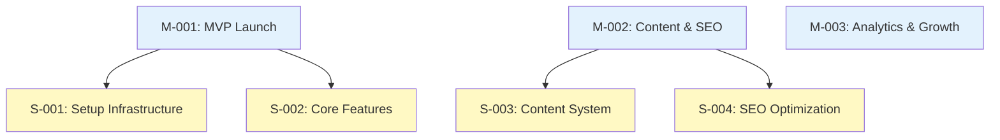

# Your First Real Project

!!! info "What You'll Learn"
    How to plan and create a real project using AI-driven workflows and visual review in Obsidian

This guide walks you through creating a complete project from scratch, demonstrating the full AI → Visual workflow.

---

## Project: Build a Personal Blog

Let's create a project to build a personal blog with modern features.

### Project Structure



---

## Step 1: Design with AI

Start by having a conversation with your AI assistant to design the project structure.

### Initial Planning

```
I want to build a personal blog. Help me break this down into milestones and stories.

Requirements:
- Modern static site (Next.js or similar)
- Markdown-based content
- SEO optimized
- Analytics integration
- Newsletter signup
- Target: Launch MVP in 4 weeks
```

### AI Response

The AI will help you think through the structure and suggest milestones and stories.

---

## Step 2: Create Milestones

Ask AI to create the milestones:

```
Create three milestones:
1. "MVP Launch" - target 4 weeks from today, workstream "engineering", priority "Critical"
2. "Content & SEO" - target 6 weeks from today, workstream "marketing", priority "High"  
3. "Analytics & Growth" - target 8 weeks from today, workstream "business", priority "Medium"
```

---

## Step 3: Break Down into Stories

For each milestone, create stories:

```
For M-001 (MVP Launch), create these stories in workstream "engineering":
1. "Setup Infrastructure" - Next.js, hosting, domain
2. "Core Features" - Blog listing, post pages, navigation
3. "Basic Styling" - Responsive design, dark mode
4. "Content Pipeline" - Markdown processing, syntax highlighting
```

---

## Step 4: Add Technical Decisions

Document key decisions:

```
Create a decision for choosing Next.js:
- Title: "Use Next.js for Static Site Generation"
- Status: "Accepted"
- Workstream: "engineering"
- Context: Need fast, SEO-friendly static site with good DX
- Decision: Use Next.js with App Router
- Consequences: Great performance, but learning curve for App Router
- Affects: S-001, S-002
```

---

## Step 5: Create Detailed Tasks

Break down S-001 into tasks:

```
For S-001 (Setup Infrastructure), create tasks in workstream "engineering":
1. "Initialize Next.js project" - status "Open"
2. "Configure Vercel deployment" - status "Open", depends on T-001
3. "Setup custom domain" - status "Open", depends on T-002
4. "Configure environment variables" - status "Open"
```

---

## Step 6: Visualize and Review

1. Open `main.canvas` in Obsidian
2. Run "Project Canvas: Populate from vault"
3. Run "Project Canvas: Reposition nodes"

**Review the structure:**
- Are milestones in logical order?
- Do dependencies make sense?
- Is anything missing?

---

## Step 7: Iterate with AI

Based on visual review, refine with AI:

```
Looking at the canvas, I think we need a story for testing. 
Add "Automated Testing" story under M-001, workstream "engineering"
```

```
The dependencies look complex. Can you check for any circular dependencies?
```

```
What's the critical path to launch M-001?
```

---

## Step 8: Track Progress

As you work, update via AI:

```
Mark T-001 as Complete
```

```
Mark S-001 as InProgress and assign to me
```

```
What's blocking M-001 from completion?
```

Refresh canvas after each update to see changes visually.

---

## Step 9: Document Specs

Create specifications for implementation:

```
Create a document "Blog Post Component Spec" in workstream "engineering":
- Describes the BlogPost React component
- Props: title, date, content, author
- Styling requirements
- Accessibility requirements
- Documents S-002
```

---

## Step 10: Review and Adjust

Use the canvas to:

- **Check progress** - Visual status of all entities
- **Identify blockers** - See dependency chains
- **Replan** - Move items between milestones if needed
- **Communicate** - Share canvas with stakeholders

---

## Best Practices Learned

!!! tip "AI for Planning"
    Use AI to brainstorm and structure, but review visually to catch issues

!!! tip "Incremental Creation"
    Create milestones first, then stories, then tasks - top-down approach

!!! tip "Document Decisions"
    Capture "why" decisions were made for future reference

!!! tip "Visual Review"
    Regularly check canvas to ensure structure makes sense

!!! tip "Iterate Quickly"
    Don't overthink - create, review, adjust, repeat

---

## Next Steps

- [User Guide](../user-guide/overview.md) - Learn all features
- [Entity Schemas](../reference/entity-schemas.md) - Understand entity types
- [Common Workflows](../examples/workflows.md) - More workflow patterns

