# Obsidian AI Project Management

> **Manage your projects by talking to AI, visualize them in Obsidian**

A complete AI-native project management system that combines the power of AI assistants with visual project organization in Obsidian.

---

## What is This?

This is a two-component system that lets you:

1. **Talk to AI to manage your project** - Create milestones, stories, tasks, track dependencies, make decisions
2. **Visualize everything in Obsidian** - See your project structure on a canvas, navigate relationships, review progress

---

## Your Workflow

```mermaid
sequenceDiagram
    participant You
    participant AI
    participant Vault as Obsidian Vault
    participant Canvas as Visual Canvas
    
    You->>AI: "Create a milestone for Q1 launch"
    AI->>Vault: Creates M-001 with 3 stories
    AI-->>You: ✓ Created M-001
    
    You->>Canvas: Opens Obsidian
    Canvas->>Vault: Reads entities
    Canvas-->>You: Shows visual structure
    
    You->>AI: "What's blocking the launch?"
    AI->>Vault: Analyzes dependencies
    AI-->>You: Reports blockers
```

---

## Components

### 1. Obsidian MCP Server
**AI-native project management via Model Context Protocol**

- Create and update entities via natural language
- Bulk operations and batch processing
- Project analysis and insights
- Dependency tracking and cycle detection
- Search and filtering

📦 **NPM Package:** [obsidian-accomplishments-mcp](https://www.npmjs.com/package/obsidian-accomplishments-mcp)

### 2. Canvas Project Manager Plugin
**Visual project management in Obsidian**

- Canvas-based visual organization
- Hierarchical entity layout
- Interactive navigation
- Relationship visualization
- Archive management

🔧 **Status:** Under review (install from source)  
📂 **Repository:** [obsidian_plugin](https://github.com/ostanlabs/obsidian_plugin)

---

## Key Features

### 🤖 AI-Powered Management
- Natural language project creation
- Intelligent dependency analysis
- Automated relationship syncing
- Bulk operations with dry-run preview

### 📊 Visual Organization
- Hierarchical canvas layout
- Workstream-based lanes
- Entity type differentiation
- Interactive navigation

### 🔗 Seamless Integration
- Shared entity model
- Bidirectional relationship sync
- Real-time updates
- Archive management

### 🎯 Smart Features
- Workstream normalization
- Transitive dependency removal
- Cycle detection
- Feature coverage tracking

---

## Use Cases

- **Solo Development** - Manage personal projects with AI assistance
- **Feature Planning** - Design and track product features
- **Technical Decisions** - Document and track architectural decisions
- **Spec-Driven Development** - AI creates specs, another AI implements
- **Progress Tracking** - Visual review of project status

---

## Getting Started

-   :material-clock-fast:{ .lg .middle } __Quick Start__

    ---

    Get up and running in 15 minutes

    [:octicons-arrow-right-24: Quick Start Guide](getting-started/quick-start.md)

-   :material-download:{ .lg .middle } __Installation__

    ---

    Detailed setup instructions for MCP server and plugin

    [:octicons-arrow-right-24: Installation Guide](getting-started/installation.md)

-   :material-book-open-variant:{ .lg .middle } __User Guide__

    ---

    Complete workflows and features reference

    [:octicons-arrow-right-24: User Guide](user-guide/overview.md)

-   :material-frequently-asked-questions:{ .lg .middle } __FAQ__

    ---

    Common questions and troubleshooting

    [:octicons-arrow-right-24: FAQ](faq.md)

---

## Support

- **Issues:** [GitHub Issues](https://github.com/ostanlabs/obsidian_plugin/issues)
- **Discussions:** [GitHub Discussions](https://github.com/ostanlabs/obsidian_plugin/discussions)

---

## License

MIT License - See individual component repositories for details.

