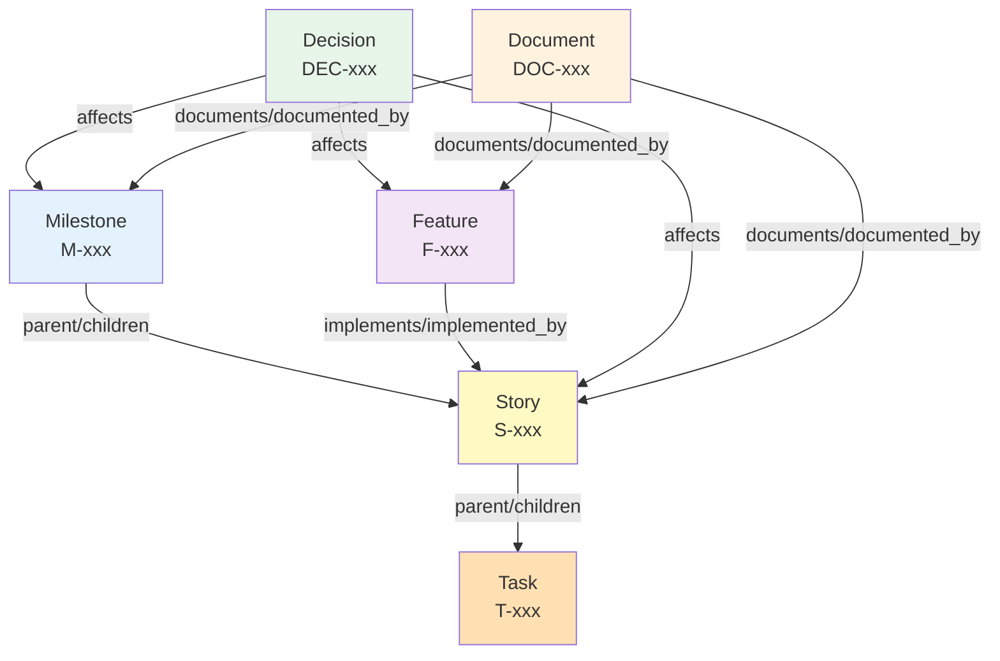
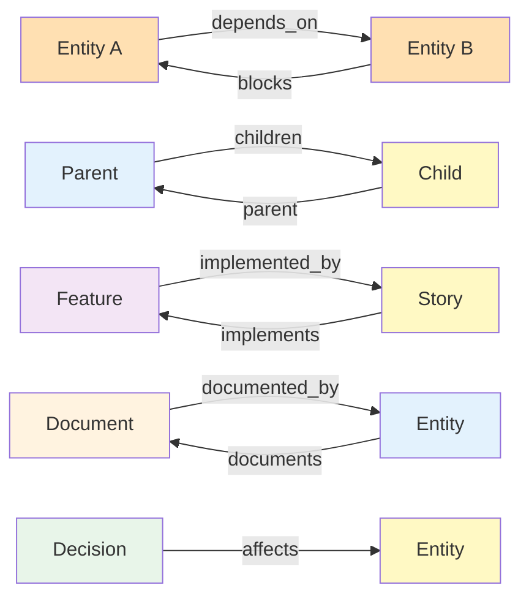

# Entity Schemas

Complete reference for all entity types in the Obsidian AI Project Management system.

---

## Entity Hierarchy



---

## Relationship Types



---

## Milestone

**ID Format:** `M-001`, `M-002`, etc.

**Purpose:** High-level project phases or major deliverables

### Schema

| Field | Type | Required | Description |
|-------|------|----------|-------------|
| `id` | string | ✅ | Unique identifier (M-xxx) |
| `title` | string | ✅ | Milestone name |
| `status` | enum | ✅ | NotStarted, InProgress, Completed, Cancelled |
| `workstream` | enum | ✅ | engineering, business, infra, research, design, marketing |
| `priority` | enum | ❌ | Critical, High, Medium, Low |
| `target_date` | date | ❌ | Target completion date |
| `actual_date` | date | ❌ | Actual completion date |
| `description` | string | ❌ | Detailed description |
| `parent` | string | ❌ | Parent milestone ID |
| `children` | array | ❌ | Child story/milestone IDs |
| `depends_on` | array | ❌ | Dependency IDs |
| `blocks` | array | ❌ | Blocked entity IDs |

### Example

```yaml
---
id: M-001
title: MVP Launch
status: InProgress
workstream: engineering
priority: Critical
target_date: 2024-03-01
description: Launch minimum viable product with core features
children:
  - S-001
  - S-002
  - S-003
---
```

---

## Story

**ID Format:** `S-001`, `S-002`, etc.

**Purpose:** User-facing features or capabilities

### Schema

| Field | Type | Required | Description |
|-------|------|----------|-------------|
| `id` | string | ✅ | Unique identifier (S-xxx) |
| `title` | string | ✅ | Story name |
| `status` | enum | ✅ | NotStarted, InProgress, Completed, Cancelled |
| `workstream` | enum | ✅ | engineering, business, infra, research, design, marketing |
| `priority` | enum | ❌ | Critical, High, Medium, Low |
| `points` | number | ❌ | Story points estimate |
| `assignee` | string | ❌ | Assigned person |
| `description` | string | ❌ | Detailed description |
| `parent` | string | ❌ | Parent milestone ID |
| `children` | array | ❌ | Child task IDs |
| `depends_on` | array | ❌ | Dependency IDs |
| `blocks` | array | ❌ | Blocked entity IDs |
| `implements` | array | ❌ | Feature IDs this implements |
| `documented_by` | array | ❌ | Document IDs |

### Example

```yaml
---
id: S-001
title: User Authentication
status: InProgress
workstream: engineering
priority: High
points: 8
assignee: john
parent: M-001
children:
  - T-001
  - T-002
implements:
  - F-001
---
```

---

## Task

**ID Format:** `T-001`, `T-002`, etc.

**Purpose:** Specific implementation work items

### Schema

| Field | Type | Required | Description |
|-------|------|----------|-------------|
| `id` | string | ✅ | Unique identifier (T-xxx) |
| `title` | string | ✅ | Task name |
| `status` | enum | ✅ | Open, InProgress, Complete, Cancelled |
| `workstream` | enum | ✅ | engineering, business, infra, research, design, marketing |
| `assignee` | string | ❌ | Assigned person |
| `description` | string | ❌ | Detailed description |
| `parent` | string | ❌ | Parent story ID |
| `depends_on` | array | ❌ | Dependency IDs |
| `blocks` | array | ❌ | Blocked entity IDs |

### Example

```yaml
---
id: T-001
title: Implement JWT token generation
status: InProgress
workstream: engineering
assignee: john
parent: S-001
depends_on:
  - T-002
---
```

---

## Feature

**ID Format:** `F-001`, `F-002`, etc.

**Purpose:** Product features that span multiple stories

### Schema

| Field | Type | Required | Description |
|-------|------|----------|-------------|
| `id` | string | ✅ | Unique identifier (F-xxx) |
| `title` | string | ✅ | Feature name |
| `status` | enum | ✅ | Planned, InProgress, Completed, Cancelled |
| `workstream` | enum | ✅ | engineering, business, infra, research, design, marketing |
| `priority` | enum | ❌ | Critical, High, Medium, Low |
| `description` | string | ❌ | Detailed description |
| `implemented_by` | array | ❌ | Story IDs that implement this |
| `depends_on` | array | ❌ | Dependency IDs |
| `documented_by` | array | ❌ | Document IDs |

### Example

```yaml
---
id: F-001
title: User Management System
status: InProgress
workstream: engineering
priority: High
description: Complete user authentication and authorization system
implemented_by:
  - S-001
  - S-002
  - S-003
---
```

---

## Decision

**ID Format:** `DEC-001`, `DEC-002`, etc.

**Purpose:** Architectural and technical decisions (ADR-style)

### Schema

| Field | Type | Required | Description |
|-------|------|----------|-------------|
| `id` | string | ✅ | Unique identifier (DEC-xxx) |
| `title` | string | ✅ | Decision title |
| `status` | enum | ✅ | Proposed, Accepted, Rejected, Deprecated |
| `workstream` | enum | ✅ | engineering, business, infra, research, design, marketing |
| `date` | date | ❌ | Decision date |
| `context` | string | ❌ | Background and context |
| `decision` | string | ❌ | The decision made |
| `consequences` | string | ❌ | Expected outcomes |
| `affects` | array | ❌ | Entity IDs affected by this decision |

### Example

```yaml
---
id: DEC-001
title: Use PostgreSQL for Primary Database
status: Accepted
workstream: engineering
date: 2024-01-15
context: Need reliable, ACID-compliant database with good JSON support
decision: Use PostgreSQL 15+ as primary database
consequences: |
  - Pros: Mature, reliable, excellent JSON support
  - Cons: More complex than SQLite for local dev
affects:
  - S-001
  - S-005
  - M-001
---
```

---

## Document

**ID Format:** `DOC-001`, `DOC-002`, etc.

**Purpose:** Specifications, designs, and technical documentation

### Schema

| Field | Type | Required | Description |
|-------|------|----------|-------------|
| `id` | string | ✅ | Unique identifier (DOC-xxx) |
| `title` | string | ✅ | Document title |
| `type` | enum | ✅ | Spec, Design, RFC, Guide, API |
| `status` | enum | ✅ | Draft, Review, Approved, Obsolete |
| `workstream` | enum | ✅ | engineering, business, infra, research, design, marketing |
| `author` | string | ❌ | Document author |
| `date` | date | ❌ | Creation/update date |
| `description` | string | ❌ | Document summary |
| `documents` | array | ❌ | Entity IDs this documents |

### Example

```yaml
---
id: DOC-001
title: Authentication API Specification
type: Spec
status: Approved
workstream: engineering
author: john
date: 2024-01-20
description: Complete API specification for authentication endpoints
documents:
  - S-001
  - F-001
---
```

---

## Workstream Values

All entities must have a `workstream` field with one of these values:

| Workstream | Description | Common Use |
|------------|-------------|------------|
| `engineering` | Technical implementation | Code, infrastructure, technical tasks |
| `business` | Business operations | Strategy, planning, business decisions |
| `infra` | Infrastructure & DevOps | Deployment, monitoring, infrastructure |
| `research` | Research & exploration | Spikes, POCs, investigation |
| `design` | Design & UX | UI/UX design, user research |
| `marketing` | Marketing & growth | Content, SEO, campaigns |

!!! note "Workstream Normalization"
    The system automatically normalizes common variations:
    - `infrastructure` → `infra`
    - `eng` → `engineering`
    - `biz` → `business`

---

## Status Values

### Milestone & Story Status

- `NotStarted` - Not yet begun
- `InProgress` - Currently being worked on
- `Completed` - Finished
- `Cancelled` - Abandoned

### Task Status

- `Open` - Not yet started
- `InProgress` - Currently being worked on
- `Complete` - Finished
- `Cancelled` - Abandoned

### Feature Status

- `Planned` - Planned but not started
- `InProgress` - Being implemented
- `Completed` - Fully implemented
- `Cancelled` - Abandoned

### Decision Status

- `Proposed` - Under consideration
- `Accepted` - Approved and active
- `Rejected` - Not approved
- `Deprecated` - No longer applicable

### Document Status

- `Draft` - Work in progress
- `Review` - Under review
- `Approved` - Finalized
- `Obsolete` - No longer current

---

## Priority Values

- `Critical` - Must be done immediately
- `High` - Important, high priority
- `Medium` - Normal priority
- `Low` - Nice to have

---

## Relationship Rules

!!! info "Bidirectional Sync"
    All relationships are automatically synced bidirectionally by the system

### Hierarchy Relationships

- `parent` ↔ `children` - Automatically synced
- Milestones can contain Stories or other Milestones
- Stories can contain Tasks
- Tasks cannot have children

### Dependency Relationships

- `depends_on` ↔ `blocks` - Automatically synced
- Any entity can depend on any other entity
- System detects and prevents circular dependencies

### Implementation Relationships

- `implements` ↔ `implemented_by` - Automatically synced
- Stories implement Features
- Multiple stories can implement one feature

### Documentation Relationships

- `documents` ↔ `documented_by` - Automatically synced
- Documents can document any entity type
- One document can document multiple entities

### Decision Impact

- `affects` - One-way relationship
- Decisions affect other entities
- No reverse relationship

