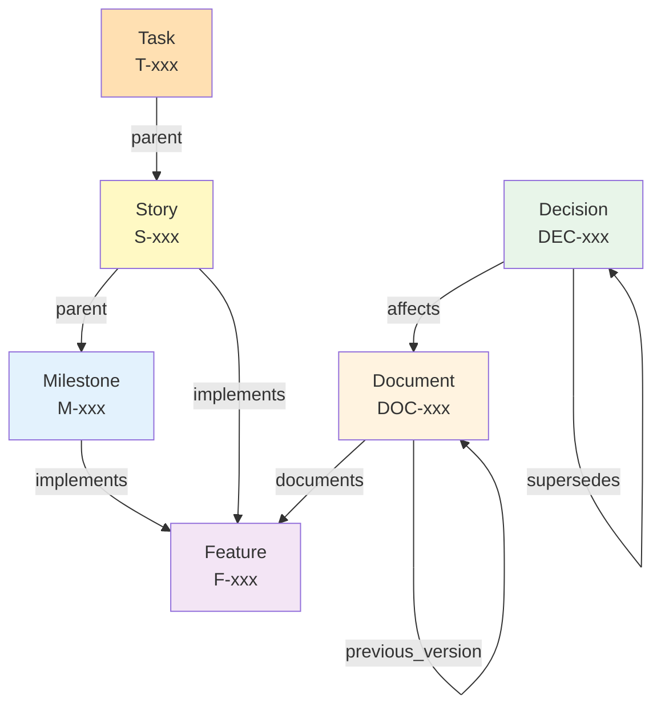

# Entity Schemas

Complete reference for all entity types in the Obsidian AI Project Management system.

---

## The Runtime Schema: `schema.json`

!!! info "This page describes the DEFAULT schema"
    The schema that is actually in effect for a vault lives in **`<vault>/schema.json`** — it is the runtime single source of truth for both MCP validation and plugin canvas positioning.

    - **Bootstrap:** on the MCP server's first run against a vault, `schema.json` is created from the built-in default schema documented on this page.
    - **Editing:** change it with the [`set_schema`](mcp-tools-complete.md#set_schema) tool (full schema or relationships-only merge), or visually with [`get_schema_designer`](mcp-tools-complete.md#get_schema_designer). Invalid schemas are rejected and not saved.
    - **Hot reload:** saved changes take effect immediately — MCP validation rules and the plugin's positioning both re-derive from the new schema without a restart.
    - **Inspecting:** [`get_schema`](mcp-tools-complete.md#get_schema) returns the active schema, its source (`file` or `default`), and any validation errors. If `schema.json` is invalid, the server falls back to the default schema and surfaces the errors.

    If your vault's `schema.json` has been customized, it — not this page — defines the valid types, statuses, fields, and relationships.

---

## Entity Hierarchy


```mermaid
graph TD
    M[Milestone<br/>M-xxx]
    S[Story<br/>S-xxx]
    T[Task<br/>T-xxx]
    F[Feature<br/>F-xxx]
    D[Decision<br/>DEC-xxx]
    DOC[Document<br/>DOC-xxx]

    S -->|parent| M
    T -->|parent| S
    M -->|implements| F
    S -->|implements| F
    DOC -->|documents| F
    D -->|affects| DOC
    D -->|supersedes| D
    DOC -->|previous_version| DOC

    style M fill:#e3f2fd
    style S fill:#fff9c4
    style T fill:#ffe0b2
    style F fill:#f3e5f5
    style D fill:#e8f5e9
    style DOC fill:#fff3e0
```

---

## Milestone

**ID Format:** `M-001`, `M-002`, etc. — **Folder:** `milestones/`

**Purpose:** High-level project phases or major deliverables

**Statuses:** `Not Started` (default), `In Progress`, `Completed`, `Blocked`

### Fields

| Field | Kind | Required | Default | Description |
|-------|------|----------|---------|-------------|
| `priority` | enum: `Low`, `Medium`, `High`, `Critical` | ✅ | `Medium` | Priority level |
| `target_date` | date | ❌ | — | Target completion date |
| `owner` | string | ❌ | — | Owner |
| `objective` | text | ❌ | — | Objective statement |
| `success_criteria` | string[] | ❌ | — | Success criteria list |

### Example

```yaml
---
id: M-001
type: milestone
title: MVP Launch
status: In Progress
workstream: engineering
priority: Critical
target_date: 2026-03-01
objective: Launch minimum viable product with core features
children:
  - S-001
  - S-002
---
```

---

## Story

**ID Format:** `S-001`, `S-002`, etc. — **Folder:** `stories/`

**Purpose:** User-facing features or capabilities

**Statuses:** `Not Started` (default), `In Progress`, `Completed`, `Blocked`

### Fields

| Field | Kind | Required | Default | Description |
|-------|------|----------|---------|-------------|
| `priority` | enum: `Low`, `Medium`, `High`, `Critical` | ✅ | `Medium` | Priority level |
| `outcome` | text | ❌ | — | Expected outcome |
| `acceptance_criteria` | string[] | ❌ | — | Acceptance criteria list |
| `notes` | text | ❌ | — | Free-form notes |

### Example

```yaml
---
id: S-001
type: story
title: User Authentication
status: In Progress
workstream: engineering
priority: High
parent: M-001
children:
  - T-001
  - T-002
implements:
  - F-001
---
```

---

## Task

**ID Format:** `T-001`, `T-002`, etc. — **Folder:** `tasks/`

**Purpose:** Specific implementation work items

**Statuses:** `Not Started` (default), `In Progress`, `Completed`, `Blocked`

### Fields

| Field | Kind | Required | Default | Description |
|-------|------|----------|---------|-------------|
| `goal` | text | ✅ | — | What the task accomplishes |
| `estimate_hrs` | number | ❌ | — | Estimated hours |
| `actual_hrs` | number | ❌ | — | Actual hours spent |
| `assignee` | string | ❌ | — | Assigned person |
| `description` | text | ❌ | — | Detailed description |
| `technical_notes` | text | ❌ | — | Technical notes |
| `notes` | text | ❌ | — | Free-form notes |

### Example

```yaml
---
id: T-001
type: task
title: Implement JWT token generation
status: In Progress
workstream: engineering
goal: Generate and validate JWT tokens for the auth flow
assignee: john
parent: S-001
depends_on:
  - T-002
---
```

---

## Decision

**ID Format:** `DEC-001`, `DEC-002`, etc. — **Folder:** `decisions/`

**Purpose:** Architectural and technical decisions (ADR-style)

**Statuses:** `Pending` (default), `Decided`, `Superseded`

### Fields

| Field | Kind | Required | Default | Description |
|-------|------|----------|---------|-------------|
| `context` | text | ❌ | — | Background and context |
| `decision` | text | ❌ | — | The decision made |
| `rationale` | text | ❌ | — | Why this option was chosen |
| `alternatives` | string[] | ❌ | — | Alternatives considered |
| `decided_by` | string | ❌ | — | Person who decided (see note below) |
| `decided_on` | date | ❌ | — | Decision date |

!!! note "Two `decided_by` fields"
    The decision entity's `decided_by` custom field is a **person** (string). It is distinct from the relationship reverse field `decided_by` that the decision-impact relationship writes onto the *targets* of `affects` (documents). They share a name but live on different entity types — no collision.

### Example

```yaml
---
id: DEC-001
type: decision
title: Use PostgreSQL for Primary Database
status: Decided
workstream: engineering
context: Need reliable, ACID-compliant database with good JSON support
decision: Use PostgreSQL 15+ as primary database
rationale: Mature, reliable, excellent JSON support
decided_on: 2026-01-15
affects:
  - DOC-003
---
```

---

## Document

**ID Format:** `DOC-001`, `DOC-002`, etc. — **Folder:** `documents/`

**Purpose:** Specifications, designs, and technical documentation

**Statuses:** `Draft` (default), `Review`, `Approved`, `Superseded`

### Fields

| Field | Kind | Required | Default | Description |
|-------|------|----------|---------|-------------|
| `doc_type` | enum: `spec`, `adr`, `vision`, `guide`, `research` | ✅ | `spec` | Document kind |
| `version` | string | ❌ | — | Document version |
| `owner` | string | ❌ | — | Document owner |
| `implementation_context` | text | ❌ | — | Implementation context |
| `content` | markdown | ❌ | — | Document body content |

### Example

```yaml
---
id: DOC-001
type: document
title: Authentication API Specification
status: Approved
workstream: engineering
doc_type: spec
version: "1.2"
owner: john
documents:
  - F-001
---
```

---

## Feature

**ID Format:** `F-001`, `F-002`, etc. — **Folder:** `features/`

**Purpose:** Product features that span multiple stories

**Statuses:** `Planned` (default), `In Progress`, `Complete`, `Deferred`

### Fields

| Field | Kind | Required | Default | Description |
|-------|------|----------|---------|-------------|
| `user_story` | text | ✅ | — | "As a... I want... so that..." |
| `tier` | enum: `OSS`, `Premium` | ✅ | `OSS` | Product tier |
| `phase` | enum: `MVP`, `0`, `1`, `2`, `3`, `4`, `5` | ✅ | `MVP` | Roadmap phase |
| `priority` | enum: `Low`, `Medium`, `High`, `Critical` | ❌ | — | Priority level |
| `test_refs` | string[] | ❌ | — | Test references |
| `content` | markdown | ❌ | — | Feature body content |

### Example

```yaml
---
id: F-001
type: feature
title: User Management System
status: In Progress
workstream: engineering
user_story: As an admin, I want to manage users so that access stays controlled
tier: OSS
phase: MVP
implemented_by:
  - S-001
  - S-002
---
```

---

## Status Values (Default Schema)

| Entity | Statuses (default in **bold**) |
|--------|-------------------------------|
| Milestone | **Not Started**, In Progress, Completed, Blocked |
| Story | **Not Started**, In Progress, Completed, Blocked |
| Task | **Not Started**, In Progress, Completed, Blocked |
| Decision | **Pending**, Decided, Superseded |
| Document | **Draft**, Review, Approved, Superseded |
| Feature | **Planned**, In Progress, Complete, Deferred |

## Priority Values

`Low`, `Medium`, `High`, `Critical` — an enum field on milestone, story (required, default `Medium`) and feature (optional).

---

## Relationships (Default Schema)

The default schema defines **7 relationships**. Each relationship has typed `from → to` pairs, a forward/reverse field pair, cardinality, a canvas edge style, and positioning metadata that drives the canvas layout.

| Relationship | Pairs (from → to) | Forward / Reverse | Cardinality (fwd/rev) | Canvas edge | Positioning |
|--------------|-------------------|-------------------|-----------------------|-------------|-------------|
| **hierarchy** | task → story, story → milestone | `parent` / `children` | one / many | gray, solid | containment — child sits under its container (`to` end) |
| **dependency** | milestone → milestone, story → story, task → task | `depends_on` / `blocks` | many / many | blue, dashed | sequencing — `depends_on` places the entity *after* its dependency (cross-workstream positioning suppressed for tasks) |
| **implementation** | milestone → feature, story → feature | `implements` / `implemented_by` | many / many | purple, solid | containment — feature sits under its implementer (`from` end) |
| **documentation** | document → feature | `documents` / `documented_by` | many / many | yellow, solid | containment — document sits under the feature (`to` end) |
| **decision-impact** | decision → document | `affects` / `decided_by` | many / many | yellow, dotted | containment — decision sits under the document it affects (`to` end) |
| **supersession** | decision → decision | `supersedes` / `superseded_by` | one / one | orange, solid | sequencing — the superseding decision comes *before* the one it replaces |
| **versioning** | document → document | `previous_version` / `next_version` | one / one | gray, dashed | sequencing — newer version comes *after* the previous one |

!!! info "Bidirectional Sync"
    Forward/reverse pairs are kept consistent by [`reconcile_relationships`](mcp-tools-complete.md#reconcile_relationships) and enforced by [`validate_project`](mcp-tools-complete.md#validate_project). Cycle prevention applies to hierarchy, dependency, supersession, and versioning.

!!! note "Dependencies are same-type only"
    In the default schema, `depends_on`/`blocks` is defined between entities of the **same type** (milestone→milestone, story→story, task→task).

---

## Workstreams

The default schema defines 6 workstreams; the default is **`engineering`**:

| Workstream | Common Use |
|------------|------------|
| `engineering` | Code, technical implementation |
| `business` | Strategy, planning, business decisions |
| `infra` | Deployment, monitoring, infrastructure |
| `research` | Spikes, POCs, investigation |
| `design` | UI/UX design, user research |
| `marketing` | Content, SEO, campaigns |

!!! note "Workstream Normalization"
    The system automatically normalizes these aliases:

    | Alias | Normalized to |
    |-------|---------------|
    | `infrastructure`, `ops`, `devops` | `infra` |
    | `eng`, `dev`, `development` | `engineering` |
    | `biz` | `business` |
    | `rnd`, `r&d` | `research` |
    | `ux`, `ui` | `design` |
    | `mktg` | `marketing` |

---

## Schema Settings (Default)

| Setting | Default | Description |
|---------|---------|-------------|
| `idPadding` | `3` | ID number zero-padding (`M-001`) |
| `archiveLayout` | `by-type` | Archive folder layout |
| `filenamePattern` | `{title}` | Title-only filenames (no ID prefix) |
| `filenameCase` | `preserve` | Slugs preserve case; spaces → `_`, hyphens kept (e.g. `Add_90-day_retention_policy.md`) |
| `overlapPriorityOrder` | milestone, story, task, decision, document, feature | Canvas overlap resolution: higher-priority nodes stay put |

---

## Deprecated: Legacy Frontmatter Aliases

!!! warning "`created`, `updated`, and `effort` are no longer migrated"
    Older vaults used `created` / `updated` / `effort` frontmatter keys (aliases of `created_at` / `updated_at` / `workstream`). The parser **no longer auto-migrates these on read** — they are kept as unknown passthrough keys and are ignored by validation and tooling. Use the canonical keys (`created_at`, `updated_at`, `workstream`) in new and updated entities.

Unknown entity types in frontmatter are likewise kept literal (passthrough) rather than coerced.

---

## Next Steps

- [MCP Tools Reference](mcp-tools-complete.md) - Create and update entities via AI
- [Relationships Guide](../user-guide/relationships.md) - Managing entity relationships
- [Configuration](configuration.md) - `schema.json` location and MCP setup
