# MCP Tools Reference

**Complete reference for all MCP server tools available to AI assistants**

---

## Overview

The Obsidian MCP Server provides **27 tools** organized into 7 categories:

```mermaid
graph TD
    MCP[MCP Server Tools]
    
    MCP --> CRUD[CRUD Operations]
    MCP --> SEARCH[Search & Navigation]
    MCP --> ANALYSIS[Analysis & Insights]
    MCP --> BULK[Bulk Operations]
    MCP --> WORKSPACE[Workspace Management]
    MCP --> SEMANTIC[Semantic Search]
    MCP --> UTILITY[Utility Tools]
    
    CRUD --> C1[create_entity]
    CRUD --> C2[update_entity]
    CRUD --> C3[handle_entity]
    
    SEARCH --> S1[search_entities]
    SEARCH --> S2[get_entity]
    SEARCH --> S3[get_entities]
    
    ANALYSIS --> A1[get_project_overview]
    ANALYSIS --> A2[analyze_project_state]
    ANALYSIS --> A3[get_feature_coverage]
    ANALYSIS --> A4[get_schema]
    
    BULK --> B1[batch_update]
    BULK --> B2[handle_entities]
    BULK --> B3[cleanup_completed]
    
    WORKSPACE --> W1[manage_workspaces]
    WORKSPACE --> W2[list_workspaces]
    WORKSPACE --> W3[list_files]
    
    SEMANTIC --> SE1[search_docs]
    SEMANTIC --> SE2[msrl_status]
    
    UTILITY --> U1[read_docs]
    UTILITY --> U2[update_doc]
    UTILITY --> U3[rebuild_index]
```



---

## Tool Categories

| Category | Count | Tools |
|----------|-------|-------|
| **CRUD Operations** | 3 | create_entity, update_entity, handle_entity |
| **Search & Navigation** | 3 | search_entities, get_entity, get_entities |
| **Analysis & Insights** | 4 | get_project_overview, analyze_project_state, get_feature_coverage, get_schema |
| **Bulk Operations** | 3 | batch_update, handle_entities, cleanup_completed |
| **Workspace Management** | 3 | manage_workspaces, list_workspaces, list_files |
| **Semantic Search** | 2 | search_docs, msrl_status |
| **Utility** | 3 | read_docs, update_doc, rebuild_index |
| **Document Management** | 1 | manage_documents |
| **TOTAL** | **27** | |

---

## CRUD Operations

### `create_entity`

Create a new entity (Milestone, Story, Task, Decision, Document, or Feature).

**Parameters:**

| Parameter | Type | Required | Description |
|-----------|------|----------|-------------|
| `type` | string | ✅ | Entity type: milestone, story, task, decision, document, feature |
| `data` | object | ✅ | Entity-specific fields (see Entity Schemas) |
| `options.add_to_canvas` | boolean | ❌ | Add to canvas (default: true) |
| `options.canvas_source` | string | ❌ | Canvas file path |

**Example:**

```json
{
  "type": "milestone",
  "data": {
    "title": "Q1 Release",
    "workstream": "engineering",
    "objective": "Deliver Q1 features",
    "priority": "P0"
  }
}
```

**Returns:**

```json
{
  "id": "M-001",
  "entity": {
    "id": "M-001",
    "type": "milestone",
    "title": "Q1 Release",
    "status": "Not Started",
    "workstream": "engineering",
    "priority": "P0",
    "objective": "Deliver Q1 features"
  },
  "dependencies_created": 0,
  "canvas_node_added": true
}
```

**Notes:**
- Auto-generates sequential ID (M-001, S-001, T-001, etc.)
- Validates required fields per entity type
- Prevents orphaned entities (stories must have parent milestone, tasks must have parent story)
- Normalizes workstream names (e.g., "infrastructure" → "infra")

---

### `update_entity`

Update existing entity fields, relationships, or status.

**Parameters:**

| Parameter | Type | Required | Description |
|-----------|------|----------|-------------|
| `id` | string | ✅ | Entity ID (e.g., "M-001") |
| `data` | object | ❌ | Fields to update |
| `status` | string | ❌ | New status (validates transitions) |
| `add_dependencies` | array | ❌ | Entity IDs to add to depends_on |
| `remove_dependencies` | array | ❌ | Entity IDs to remove from depends_on |
| `archived` | boolean | ❌ | Archive (true) or restore (false) |
| `return_full` | boolean | ❌ | Return full entity (default: false for minimal response) |
| `return_fields` | array | ❌ | Specific fields to return |

**Example:**

```json
{
  "id": "S-015",
  "status": "In Progress",
  "data": {
    "priority": "P0"
  },
  "add_dependencies": ["S-012", "S-013"]
}
```

**Returns:**

```json
{
  "id": "S-015",
  "updated_fields": ["status", "priority", "depends_on"],
  "entity": {
    "id": "S-015",
    "status": "In Progress",
    "priority": "P0"
  }
}
```

**Notes:**
- Validates status transitions (e.g., can't go from "Not Started" to "Completed")
- Detects circular dependencies
- Supports cascade status updates (update children when parent completes)
- Archive/restore moves files to/from `archive/` folders

---

### `handle_entity`

Unified entity handler - routes to create, get, or update based on action.

**Parameters:**

| Parameter | Type | Required | Description |
|-----------|------|----------|-------------|
| `action` | string | ✅ | Action: create, get, update |
| ...rest | varies | varies | Parameters depend on action |

**Example:**

```json
{
  "action": "create",
  "type": "story",
  "title": "User Authentication",
  "workstream": "engineering",
  "parent": "M-001"
}
```

**Notes:**
- Flat schema (no nested `data` object)
- Simplifies AI tool calls
- Routes to appropriate CRUD function

---

## Search & Navigation

### `search_entities`

Full-text and semantic search across entities with filters.

**Modes:**
1. **Semantic Search** - `query` + `semantic=true` (MSRL hybrid search)
2. **Full-Text Search** - `query` only (BM25 search)
3. **Navigation** - `from_id` + `direction` (traverse relationships)
4. **List** - `filters` only (list entities)

**Parameters:**

| Parameter | Type | Required | Description |
|-----------|------|----------|-------------|
| `query` | string | ❌ | Search query text |
| `semantic` | boolean | ❌ | Use semantic search (default: false) |
| `from_id` | string | ❌ | Starting entity for navigation |
| `direction` | string | ❌ | Navigation direction: parent, children, dependencies, dependents, documents, decisions, features |
| `filters.type` | array | ❌ | Entity types to include |
| `filters.status` | array | ❌ | Statuses to include |
| `filters.workstream` | array | ❌ | Workstreams to include |
| `filters.archived` | boolean | ❌ | Include archived entities |
| `fields` | array | ❌ | Fields to return (default: id, type, title, status, workstream) |
| `max_items` | integer | ❌ | Max results (default: 20, max: 200) |
| `since` | string | ❌ | Only return entities modified after this timestamp |

**Example (Semantic Search):**

```json
{
  "query": "authentication implementation",
  "semantic": true,
  "filters": {
    "type": ["story", "task"]
  },
  "max_items": 10
}
```

**Example (Navigation):**

```json
{
  "from_id": "M-001",
  "direction": "children",
  "filters": {
    "status": ["In Progress"]
  }
}
```

**Returns:**

```json
{
  "results": [
    {
      "id": "S-015",
      "type": "story",
      "title": "User Authentication",
      "status": "In Progress",
      "workstream": "engineering",
      "score": 0.85
    }
  ],
  "count": 1,
  "total_count": 1,
  "has_more": false
}
```

---

### `get_entity`

Get a single entity by ID with optional field selection.

**Parameters:**

| Parameter | Type | Required | Description |
|-----------|------|----------|-------------|
| `id` | string | ✅ | Entity ID |
| `fields` | array | ❌ | Fields to return (default: all) |

**Example:**

```json
{
  "id": "M-001",
  "fields": ["id", "title", "status", "children", "children_count"]
}
```

**Returns:**

```json
{
  "id": "M-001",
  "title": "Q1 Release",
  "status": "In Progress",
  "children": ["S-001", "S-002", "S-003"],
  "children_count": 3
}
```

---

### `get_entities`

Get multiple entities by IDs (batch get).

**Parameters:**

| Parameter | Type | Required | Description |
|-----------|------|----------|-------------|
| `ids` | array | ✅ | Array of entity IDs |
| `fields` | array | ❌ | Fields to return |

**Example:**

```json
{
  "ids": ["M-001", "S-015", "T-042"],
  "fields": ["id", "title", "status"]
}
```

---

## Analysis & Insights

### `get_project_overview`

Get high-level project summary with statistics.

**Parameters:**

| Parameter | Type | Required | Description |
|-----------|------|----------|-------------|
| `include_workstreams` | boolean | ❌ | Include workstream breakdown (default: true) |
| `include_recent` | boolean | ❌ | Include recently updated entities (default: true) |

**Returns:**

```json
{
  "summary": {
    "total_entities": 156,
    "by_type": {
      "milestone": 12,
      "story": 45,
      "task": 89,
      "decision": 8,
      "document": 2,
      "feature": 0
    },
    "by_status": {
      "Not Started": 45,
      "In Progress": 23,
      "Completed": 78,
      "Blocked": 10
    }
  },
  "workstreams": [
    {
      "name": "engineering",
      "entity_count": 89,
      "in_progress": 15,
      "blocked": 3
    }
  ],
  "recent_updates": [
    {
      "id": "S-015",
      "title": "User Authentication",
      "status": "In Progress",
      "updated_at": "2026-01-24T14:30:00Z"
    }
  ]
}
```

---

### `analyze_project_state`

Detailed project analysis with dependency graph, blockers, and risks.

**Parameters:**

| Parameter | Type | Required | Description |
|-----------|------|----------|-------------|
| `include_dependency_graph` | boolean | ❌ | Include full dependency graph (default: false) |
| `include_blockers` | boolean | ❌ | Include blocked entities analysis (default: true) |

**Returns:**

```json
{
  "health_score": 0.75,
  "blockers": [
    {
      "id": "S-015",
      "title": "User Authentication",
      "blocked_by": ["S-012", "S-013"],
      "blocking": ["T-042", "T-043"]
    }
  ],
  "risks": [
    {
      "type": "circular_dependency",
      "entities": ["S-015", "S-016", "S-015"],
      "severity": "high"
    }
  ],
  "dependency_graph": {
    "nodes": ["M-001", "S-015", "T-042"],
    "edges": [
      {"from": "T-042", "to": "S-015"},
      {"from": "S-015", "to": "M-001"}
    ]
  }
}
```

---

### `get_feature_coverage`

Analyze feature implementation, documentation, and test coverage.

**Parameters:**

| Parameter | Type | Required | Description |
|-----------|------|----------|-------------|
| `tier` | string | ❌ | Filter by tier: OSS, Premium |
| `phase` | string | ❌ | Filter by phase: MVP, 0-5 |
| `show_gaps_only` | boolean | ❌ | Only show features with gaps (default: false) |

**Returns:**

```json
{
  "summary": {
    "total_features": 24,
    "implemented": 18,
    "documented": 15,
    "tested": 12,
    "complete": 10
  },
  "gaps": {
    "missing_implementation": ["F-005", "F-012"],
    "missing_documentation": ["F-003", "F-007", "F-015"],
    "missing_tests": ["F-001", "F-008", "F-011", "F-019"]
  },
  "features": [
    {
      "id": "F-001",
      "title": "User Authentication",
      "tier": "OSS",
      "phase": "MVP",
      "status": "Complete",
      "implemented_by": ["S-015", "S-016"],
      "documented_by": ["DOC-003"],
      "test_refs": [],
      "coverage": {
        "implementation": true,
        "documentation": true,
        "tests": false
      }
    }
  ]
}
```

---

### `get_schema`

Get entity schema definitions with field types and relationships.

**Parameters:**

| Parameter | Type | Required | Description |
|-----------|------|----------|-------------|
| `entity_type` | string | ❌ | Specific entity type (default: all) |
| `relationships_only` | boolean | ❌ | Only return relationship fields (default: false) |

**Returns:**

```json
{
  "schemas": [
    {
      "type": "milestone",
      "id_pattern": "M-XXX",
      "fields": {
        "id": {
          "type": "MilestoneId",
          "required": true,
          "description": "Unique identifier (M-XXX format)"
        },
        "title": {
          "type": "string",
          "required": true,
          "description": "Milestone title"
        },
        "status": {
          "type": "enum",
          "required": true,
          "values": ["Planned", "In Progress", "Complete", "Blocked", "Deferred"]
        }
      }
    }
  ]
}
```

---

## Bulk Operations

### `batch_update`

Perform multiple create/update/archive operations in a single call.

**Parameters:**

| Parameter | Type | Required | Description |
|-----------|------|----------|-------------|
| `ops` | array | ✅ | Array of operations |
| `options.atomic` | boolean | ❌ | Rollback all if any fails (default: false) |
| `options.dry_run` | boolean | ❌ | Preview changes without applying (default: false) |
| `options.include_entities` | boolean | ❌ | Return full entities in results (default: false) |
| `options.fields` | array | ❌ | Fields to return |

**Operation Types:**
- `create` - Create new entity
- `update` - Update existing entity
- `archive` - Archive entity

**Example:**

```json
{
  "ops": [
    {
      "op": "create",
      "client_id": "temp-1",
      "type": "milestone",
      "data": {
        "title": "Q2 Release",
        "workstream": "engineering"
      }
    },
    {
      "op": "create",
      "type": "story",
      "data": {
        "title": "API Redesign",
        "workstream": "engineering",
        "parent": "{{temp-1}}"
      }
    },
    {
      "op": "update",
      "id": "S-015",
      "data": {
        "status": "In Progress"
      }
    }
  ],
  "options": {
    "dry_run": false,
    "atomic": true
  }
}
```

**Returns:**

```json
{
  "results": [
    {
      "op": "create",
      "client_id": "temp-1",
      "success": true,
      "id": "M-005",
      "message": "Created milestone M-005"
    },
    {
      "op": "create",
      "success": true,
      "id": "S-042",
      "message": "Created story S-042"
    },
    {
      "op": "update",
      "success": true,
      "id": "S-015",
      "message": "Updated story S-015"
    }
  ],
  "summary": {
    "total": 3,
    "succeeded": 3,
    "failed": 0
  }
}
```

**Notes:**
- `client_id` enables cross-referencing within batch (use `{{client_id}}` syntax)
- Idempotent - same `client_id` won't create duplicates
- Atomic mode rolls back all changes if any operation fails

---

### `handle_entities`

Unified batch handler - routes to batch or get operations.

**Parameters:**

| Parameter | Type | Required | Description |
|-----------|------|----------|-------------|
| `action` | string | ✅ | Action: batch, get |
| ...rest | varies | varies | Parameters depend on action |

---

### `cleanup_completed`

Archive all completed entities (status: Completed).

**Parameters:**

| Parameter | Type | Required | Description |
|-----------|------|----------|-------------|
| `dry_run` | boolean | ❌ | Preview without archiving (default: false) |
| `include_orphaned` | boolean | ❌ | Archive even if it orphans other entities (default: false) |

**Returns:**

```json
{
  "archived_count": 15,
  "archived_ids": ["M-001", "S-005", "S-012", "T-023"],
  "would_orphan": ["DEC-003", "DOC-007"],
  "requires_confirmation": true
}
```

---

## Workspace Management

### `manage_workspaces`

Create, update, or delete workspace configurations.

**Parameters:**

| Parameter | Type | Required | Description |
|-----------|------|----------|-------------|
| `action` | string | ✅ | Action: create, update, delete, get |
| `workspace` | string | ✅ | Workspace name |
| `config` | object | ❌ | Workspace configuration |

**Example:**

```json
{
  "action": "create",
  "workspace": "architecture-docs",
  "config": {
    "path": "docs/architecture",
    "description": "Architecture decision records and design docs"
  }
}
```

---

### `list_workspaces`

List all configured workspaces.

**Parameters:** None

**Returns:**

```json
{
  "workspaces": [
    {
      "name": "docs",
      "path": "/vault/docs",
      "description": "Documentation workspace",
      "file_count": 23
    }
  ],
  "count": 1,
  "config_last_changed": "2026-01-24T14:30:00Z"
}
```

---

### `list_files`

List all markdown files in a workspace.

**Parameters:**

| Parameter | Type | Required | Description |
|-----------|------|----------|-------------|
| `workspace` | string | ✅ | Workspace name |
| `max_items` | integer | ❌ | Max results (default: 20, max: 200) |

**Returns:**

```json
{
  "workspace": "docs",
  "workspace_description": "Documentation workspace",
  "files": [
    {
      "name": "architecture/ADR-001.md",
      "path": "/vault/docs/architecture/ADR-001.md",
      "size": 2048,
      "last_changed": "2026-01-24T14:30:00Z"
    }
  ],
  "count": 1
}
```

---

## Semantic Search

### `search_docs`

Hybrid vector + keyword search across all vault documents.

**Parameters:**

| Parameter | Type | Required | Description |
|-----------|------|----------|-------------|
| `query` | string | ✅ | Search query text |
| `top_k` | integer | ❌ | Number of results (default: 8, max: 50) |
| `max_excerpt_chars` | integer | ❌ | Max excerpt length (default: 4000, max: 20000) |
| `filters.doc_uri_prefix` | string | ❌ | Filter to documents starting with path |
| `filters.doc_uris` | array | ❌ | Filter to specific document URIs |
| `filters.heading_path_contains` | string | ❌ | Filter to sections containing heading text |
| `include_scores` | boolean | ❌ | Include detailed scores (default: false) |

**Example:**

```json
{
  "query": "authentication implementation",
  "top_k": 10,
  "filters": {
    "doc_uri_prefix": "decisions/"
  }
}
```

**Returns:**

```json
{
  "results": [
    {
      "doc_uri": "decisions/DEC-001_PostgreSQL_Database.md",
      "heading_path": "Security > Authentication",
      "excerpt": "We chose JWT tokens for authentication...",
      "start_char": 1234,
      "end_char": 1456,
      "vector_score": 0.85,
      "bm25_score": 0.72,
      "hybrid_score": 0.81
    }
  ],
  "count": 1,
  "took_ms": 45
}
```

**Notes:**
- Combines 75% vector similarity + 25% BM25 keyword matching
- Returns exact provenance (file, heading, character position)
- Incremental updates (~750ms per file change)
- See [Semantic Search Guide](../user-guide/semantic-search.md) for details

---

### `msrl_status`

Get the status of the semantic search index.

**Parameters:** None

**Returns:**

```json
{
  "state": "ready",
  "snapshot_id": "snapshot_20260124_143022",
  "stats": {
    "doc_count": 156,
    "node_count": 892,
    "leaf_count": 2341,
    "shard_count": 3
  },
  "watcher": {
    "active": true,
    "last_event": "2026-01-24T14:30:22Z"
  }
}
```

---

## Utility Tools

### `read_docs`

Read content from a document in a workspace.

**Parameters:**

| Parameter | Type | Required | Description |
|-----------|------|----------|-------------|
| `workspace` | string | ✅ | Workspace name |
| `doc_name` | string | ✅ | Document name (auto-adds .md extension) |
| `line_range` | array | ❌ | [start, end] line numbers to read |

**Example:**

```json
{
  "workspace": "docs",
  "doc_name": "architecture/ADR-001",
  "line_range": [1, 50]
}
```

**Returns:**

```json
{
  "workspace": "docs",
  "workspace_description": "Documentation workspace",
  "doc_name": "architecture/ADR-001.md",
  "content": "# ADR-001: Use PostgreSQL\n\n...",
  "line_count": 50,
  "last_changed": "2026-01-24T14:30:00Z"
}
```

---

### `update_doc`

Create or update a document in a workspace.

**Parameters:**

| Parameter | Type | Required | Description |
|-----------|------|----------|-------------|
| `workspace` | string | ✅ | Workspace name |
| `name` | string | ✅ | Document name |
| `operation` | string | ✅ | Operation: create, replace, append, prepend, insert, delete |
| `content` | string | ❌ | Content to write (for create/replace/append/prepend) |
| `line_number` | integer | ❌ | Line number (for insert/delete) |
| `line_range` | array | ❌ | [start, end] for delete operation |

**Example:**

```json
{
  "workspace": "docs",
  "name": "new-doc.md",
  "operation": "create",
  "content": "# New Document\n\nContent here."
}
```

**Returns:**

```json
{
  "success": true,
  "operation": "create",
  "doc_name": "new-doc.md",
  "line_count": 3,
  "last_changed": "2026-01-24T14:30:00Z"
}
```

---

### `rebuild_index`

Rebuild the in-memory entity index from scratch.

**Parameters:** None

**Returns:**

```json
{
  "success": true,
  "entities_indexed": 156,
  "took_ms": 1234
}
```

**Use Cases:**
- After manual file system changes
- After vault corruption
- Debugging index issues

---

## Document Management

### `manage_documents`

Create or update decision/document entities with content.

**Parameters:**

| Parameter | Type | Required | Description |
|-----------|------|----------|-------------|
| `action` | string | ✅ | Action: create, update |
| `type` | string | ✅ | Type: decision, document |
| `id` | string | ❌ | Entity ID (for update) |
| `data` | object | ✅ | Entity fields |
| `content` | string | ❌ | Document content |

**Example:**

```json
{
  "action": "create",
  "type": "decision",
  "data": {
    "title": "Use PostgreSQL",
    "workstream": "engineering",
    "affects": ["S-015", "S-016"]
  },
  "content": "# Decision: Use PostgreSQL\n\n## Context\n..."
}
```

---

## Best Practices

### ✅ DO

**Entity Creation:**
- Use `create_entity` for single entities
- Use `batch_update` for multiple related entities
- Always specify `workstream` for better organization
- Use `client_id` in batch operations for cross-referencing

**Search:**
- Use `semantic=true` for meaning-based search
- Use `search_entities` without `semantic` for exact keyword matching
- Use `filters` to narrow results
- Use `fields` parameter to reduce response size

**Updates:**
- Use `return_full=false` for minimal responses (saves context window)
- Use `dry_run=true` for bulk operations first
- Use `cascade=true` for status updates that should affect children

**Relationships:**
- Use navigation mode (`from_id` + `direction`) to traverse relationships
- Use `get_feature_coverage` to find implementation gaps
- Use `analyze_project_state` to find blockers and risks

### ❌ DON'T

**Avoid:**
- Creating orphaned entities (stories without milestones, tasks without stories)
- Circular dependencies (use `analyze_project_state` to detect)
- Manual frontmatter edits without running reconciliation
- Large batch operations without `dry_run` first

**Performance:**
- Don't request all fields if you only need a few
- Don't use `return_full=true` unless necessary
- Don't set `max_items` > 200 (context window limit)
- Don't use semantic search for simple ID lookups

---

## Common Workflows

### 1. Create Project Structure

```
1. create_entity (Milestone)
2. batch_update (create multiple Stories with parent: M-XXX)
3. batch_update (create Tasks for each Story)
4. get_project_overview (verify structure)
```

### 2. Track Progress

```
1. search_entities (filters: {status: ["In Progress"]})
2. update_entity (mark task complete)
3. get_project_overview (check updated stats)
```

### 3. Find Implementation Gaps

```
1. get_feature_coverage (show_gaps_only: true)
2. search_entities (semantic: true, query: "feature X implementation")
3. batch_update (link features to implementing entities)
```

### 4. Dependency Management

```
1. create_entity (with depends_on)
2. analyze_project_state (check for cycles)
3. search_entities (from_id: "S-XXX", direction: "dependencies")
```

---

## Tool Summary

| Tool | Category | Primary Use Case |
|------|----------|------------------|
| `create_entity` | CRUD | Create single entity |
| `update_entity` | CRUD | Update entity fields/status |
| `handle_entity` | CRUD | Unified CRUD handler |
| `search_entities` | Search | Find entities by query/filters |
| `get_entity` | Search | Get single entity |
| `get_entities` | Search | Get multiple entities |
| `get_project_overview` | Analysis | High-level project stats |
| `analyze_project_state` | Analysis | Detailed analysis with blockers |
| `get_feature_coverage` | Analysis | Feature implementation status |
| `get_schema` | Analysis | Entity schema definitions |
| `batch_update` | Bulk | Multiple operations in one call |
| `handle_entities` | Bulk | Unified batch handler |
| `cleanup_completed` | Bulk | Archive completed entities |
| `manage_workspaces` | Workspace | CRUD for workspaces |
| `list_workspaces` | Workspace | List all workspaces |
| `list_files` | Workspace | List files in workspace |
| `search_docs` | Semantic | Hybrid semantic search |
| `msrl_status` | Semantic | Index status |
| `read_docs` | Utility | Read document content |
| `update_doc` | Utility | Create/update documents |
| `rebuild_index` | Utility | Rebuild entity index |
| `manage_documents` | Document | Create/update decisions/docs |

---

## Next Steps

- [Semantic Search Guide](../user-guide/semantic-search.md) - Learn semantic search workflows
- [AI Workflows](../user-guide/ai-workflows.md) - AI-driven project management
- [Entity Schemas](entity-schemas.md) - Complete entity field reference
- [Plugin Commands](plugin-commands-complete.md) - Visual canvas commands

