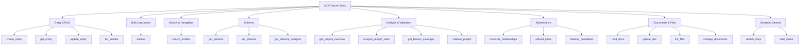

# MCP Tools Reference

**Complete reference for all MCP server tools available to AI assistants**

---

## Overview

The Obsidian MCP Server provides **22 tools** organized into 8 categories:


```mermaid
graph TD
    MCP[MCP Server Tools]

    MCP --> CRUD[Entity CRUD]
    MCP --> BULK[Bulk Operations]
    MCP --> SEARCH[Search & Navigation]
    MCP --> SCHEMA[Schema]
    MCP --> ANALYSIS[Analysis & Validation]
    MCP --> MAINT[Maintenance]
    MCP --> DOCS[Documents & Files]
    MCP --> SEMANTIC[Semantic Search]

    CRUD --> C1[create_entity]
    CRUD --> C2[get_entity]
    CRUD --> C3[update_entity]
    CRUD --> C4[list_entities]

    BULK --> B1[entities]

    SEARCH --> S1[search_entities]

    SCHEMA --> SC1[get_schema]
    SCHEMA --> SC2[set_schema]
    SCHEMA --> SC3[get_schema_designer]

    ANALYSIS --> A1[get_project_overview]
    ANALYSIS --> A2[analyze_project_state]
    ANALYSIS --> A3[get_feature_coverage]
    ANALYSIS --> A4[validate_project]

    MAINT --> M1[reconcile_relationships]
    MAINT --> M2[rebuild_index]
    MAINT --> M3[cleanup_completed]

    DOCS --> D1[read_docs]
    DOCS --> D2[update_doc]
    DOCS --> D3[list_files]
    DOCS --> D4[manage_documents]

    SEMANTIC --> SE1[search_docs]
    SEMANTIC --> SE2[msrl_status]
```

---

## Tool Categories

| Category | Count | Tools |
|----------|-------|-------|
| **Entity CRUD** | 4 | create_entity, get_entity, update_entity, list_entities |
| **Bulk Operations** | 1 | entities |
| **Search & Navigation** | 1 | search_entities |
| **Schema** | 3 | get_schema, set_schema, get_schema_designer |
| **Analysis & Validation** | 4 | get_project_overview, analyze_project_state, get_feature_coverage, validate_project |
| **Maintenance** | 3 | reconcile_relationships, rebuild_index, cleanup_completed |
| **Documents & Files** | 4 | read_docs, update_doc, list_files, manage_documents |
| **Semantic Search** | 2 | search_docs, msrl_status |
| **TOTAL** | **22** | |

!!! warning "Relationships must be nested under `relationships`"
    When writing relationship fields (`parent`, `depends_on`, `implements`, `documents`, `affects`, `supersedes`, `previous_version`, ...) via `create_entity`, `update_entity`, or the `entities` batch tool, they **must** be nested under the `relationships` key (`properties.relationships`, `updates.relationships`, or `payload.relationships`). Flat relationship keys are **silently ignored** — no error is returned, and the relationship is simply not written.

---

## Entity CRUD

### `create_entity`

Create a new entity (milestone, story, task, decision, document, or feature).

**Parameters:**

| Parameter | Type | Required | Description |
|-----------|------|----------|-------------|
| `type` | string | ✅ | Entity type: `milestone`, `story`, `task`, `decision`, `document`, `feature` |
| `title` | string | ✅ | The title of the entity |
| `properties` | object | ❌ | Additional properties: `status`, `workstream`, `relationships`, and any schema-defined custom fields |

**Example:**

```json
{
  "type": "milestone",
  "title": "Q1 Release",
  "properties": {
    "workstream": "engineering",
    "priority": "High",
    "objective": "Deliver Q1 features",
    "relationships": {
      "depends_on": ["M-001"]
    }
  }
}
```

**Returns:** confirmation text with the allocated ID and file path, e.g. `Created milestone M-005: Q1 Release`.

**Notes:**

- Auto-allocates the next sequential ID (M-001, S-001, T-001, DEC-001, DOC-001, F-001)
- Validates the entity against the active schema before writing
- Default status is the entity type's first/default status (e.g. `Not Started`); default workstream is `engineering`
- YAML safety: colons in titles and string fields are rewritten (`"Component 3: Config"` → `"Component 3 - Config"`)
- Relationship fields go under `properties.relationships` (see warning above)

---

### `get_entity`

Get an entity by ID.

**Parameters:**

| Parameter | Type | Required | Description |
|-----------|------|----------|-------------|
| `id` | string | ✅ | Entity ID (e.g., `M-001`, `S-035`, `T-127`) |

**Returns:** the full entity as JSON (id, type, title, status, workstream, timestamps, custom fields, relationships).

---

### `update_entity`

Update an existing entity.

**Parameters:**

| Parameter | Type | Required | Description |
|-----------|------|----------|-------------|
| `id` | string | ✅ | Entity ID to update |
| `updates` | object | ✅ | Fields to update: `title`, `status`, `workstream`, `fields`, `relationships`, etc. |

**Example:**

```json
{
  "id": "S-015",
  "updates": {
    "status": "In Progress",
    "relationships": {
      "depends_on": ["S-012", "S-013"]
    }
  }
}
```

!!! tip "Flat relationship keys are accepted"
    `{ "updates": { "parent": "M-001" } }` works — schema-declared relationship fields passed as flat keys are routed into `relationships` automatically. Nesting under `updates.relationships` remains the canonical form shown above.

**Notes:**

- Validates the updated entity against the active schema; only errors *introduced by this update* block the write (pre-existing validation errors on the stored entity do not)
- A string `body` key replaces the markdown body below the frontmatter (`""` clears it); when `body` is not passed, the existing body is preserved
- Setting a passthrough-only key (a field not valid for this entity type) to `null` or `[]` deletes it from the file
- Works on archived entities too (files under `archive/` are found and updated in place)
- String values are YAML-sanitized (colons replaced) like `create_entity`
- Sets `updated_at` automatically

---

### `list_entities`

List all entities or filter by type.

**Parameters:**

| Parameter | Type | Required | Description |
|-----------|------|----------|-------------|
| `type` | string | ❌ | Filter by entity type: `milestone`, `story`, `task`, `decision`, `document`, `feature` |

**Returns:** a summary list, one line per entity: `- [S-015] User Authentication (In Progress)`.

---

## Bulk Operations

### `entities`

Unified bulk operations tool: fetch multiple entities, or perform batch create/update/archive operations in a single call.

**Parameters:**

| Parameter | Type | Required | Description |
|-----------|------|----------|-------------|
| `action` | string | ✅ | `get` or `batch` |
| `ids` | array | For `get` | Entity IDs to fetch |
| `fields` | array | ❌ | Fields to include in `get` responses (default: all) |
| `ops` | array | For `batch` | Operations to perform (see below) |
| `options.atomic` | boolean | ❌ | Roll back all on any failure (default: false) |
| `options.dry_run` | boolean | ❌ | Preview changes without executing (default: false) |
| `options.include_entities` | boolean | ❌ | Include full entity data in results (default: false) |

**Each op in `ops`:**

| Field | Type | Required | Description |
|-------|------|----------|-------------|
| `client_id` | string | ✅ | Client-provided ID for idempotency and cross-referencing |
| `op` | string | ✅ | `create`, `update`, or `archive` |
| `type` | string | For `create` | Entity type |
| `id` | string | For `update`/`archive` | Entity ID |
| `payload` | object | ✅ | Operation payload: `title`, `status`, `workstream`, `relationships`, custom fields |

**Example (batch):**

```json
{
  "action": "batch",
  "ops": [
    {
      "client_id": "temp-1",
      "op": "create",
      "type": "milestone",
      "payload": { "title": "Q2 Release", "workstream": "engineering" }
    },
    {
      "client_id": "temp-2",
      "op": "create",
      "type": "story",
      "payload": {
        "title": "API Redesign",
        "relationships": { "parent": "{{temp-1}}" }
      }
    },
    {
      "client_id": "upd-1",
      "op": "update",
      "id": "S-015",
      "payload": { "status": "In Progress" }
    }
  ],
  "options": { "dry_run": false, "atomic": true }
}
```

**Example (get):**

```json
{
  "action": "get",
  "ids": ["M-001", "S-015", "T-042"],
  "fields": ["id", "title", "status"]
}
```

**Returns (get):** `{ "entities": [...], "count": 3, "not_found": [...] }`

!!! warning "Nest relationships under `payload.relationships`"
    Flat relationship keys in `payload` (e.g. `"parent": "M-001"` at the top level) are **silently ignored**. Always write `"relationships": { "parent": "M-001" }` inside the payload.

**Notes:**

- `client_id` provides idempotency: an already-processed `client_id` is not re-executed and returns its previously allocated ID
- Use `{{client_id}}` in payload values to reference an entity created earlier in the same batch
- `atomic: true` rolls back all operations if any fails; `dry_run: true` previews IDs and changes without writing

---

## Search & Navigation

### `search_entities`

Search, list, or navigate structured project entities.

**Modes:**

1. **Search** — `query="text"` for full-text search
2. **List** — `filters` only, e.g. `{type: ["task"], status: ["Blocked"]}`
3. **Navigate** — `from_id` + `direction` to traverse the hierarchy

**Parameters:**

| Parameter | Type | Required | Description |
|-----------|------|----------|-------------|
| `query` | string | ❌ | Search query (search mode) |
| `from_id` | string | ❌ | Starting entity ID (navigation mode) |
| `direction` | string | ❌ | Navigation direction: `up`, `down`, `siblings`, `dependencies` |
| `depth` | number | ❌ | Traversal depth (default: 1) |
| `filters.type` | array | ❌ | Entity types to include |
| `filters.status` | array | ❌ | Statuses to include |
| `filters.workstream` | array | ❌ | Workstreams to include |
| `filters.archived` | boolean | ❌ | Include archived (default: false) |
| `limit` | number | ❌ | Max results (default: 20) |

**Example (list):**

```json
{
  "filters": {
    "type": ["task"],
    "status": ["Blocked"]
  }
}
```

**Example (navigation):**

```json
{
  "from_id": "M-001",
  "direction": "down",
  "depth": 2
}
```

---

## Schema

### `get_schema`

Get the active schema (from `schema.json` or the codified default), its source, and any validation errors.

**Parameters:** None

**Returns:**

```json
{
  "source": "file",
  "path": "/path/to/vault/schema.json",
  "errors": [],
  "schema": { "schemaVersion": 1, "entityTypes": [...], "relationships": [...], "workstreams": {...}, "settings": {...} }
}
```

**Notes:**

- `source` is `file` when `<vault>/schema.json` is in effect, or `default` when falling back to the built-in schema
- If `schema.json` exists but is invalid, `errors` lists the problems and the default schema is used

---

### `set_schema`

Configure the vault's relationships/schema. Writes `<vault>/schema.json` — the single source of truth for both the MCP validator and the plugin positioning — and hot-reloads it.

**Parameters:**

| Parameter | Type | Required | Description |
|-----------|------|----------|-------------|
| `schema` | object | ❌* | Full `Schema` object (entityTypes, relationships, settings, workstreams) |
| `relationships` | array | ❌* | Relationships array to merge into the current schema (relationships-only edit) |

*One of `schema` or `relationships` is required.

**Returns:**

```json
{
  "saved": true,
  "path": "/path/to/vault/schema.json",
  "entityTypes": 6,
  "relationships": 7
}
```

**Notes:**

- The candidate schema is validated first; **invalid schemas are rejected and not saved** (the error response lists the validation failures)
- On success the new schema takes effect immediately (hot-reload) — no server restart needed
- The relationships-only form is what the schema designer's "copy" output feeds

---

### `get_schema_designer`

Return a self-contained HTML relationship designer, pre-populated with this vault's active schema.

**Parameters:** None

**Returns:** a single HTML document. Save it to a file, open it in a browser, toggle relationships/pairs, then copy the result and apply it with `set_schema`.

---

## Analysis & Validation

### `get_project_overview`

Get a high-level project status summary across workstreams: entity counts by type and status, workstream breakdowns.

**Parameters:**

| Parameter | Type | Required | Description |
|-----------|------|----------|-------------|
| `include_completed` | boolean | ❌ | Include completed items |
| `include_archived` | boolean | ❌ | Include archived items |
| `workstream` | string | ❌ | Filter by specific workstream |

---

### `analyze_project_state`

Deep analysis of project state identifying blockers and suggesting actions.

**Parameters:**

| Parameter | Type | Required | Description |
|-----------|------|----------|-------------|
| `workstream` | string | ❌ | Filter by workstream |
| `focus` | string | ❌ | Analysis focus: `blockers`, `actions`, `both` |

---

### `get_feature_coverage`

Analyze feature implementation and documentation coverage: coverage reports, gap analysis, undocumented features.

**Parameters:**

| Parameter | Type | Required | Description |
|-----------|------|----------|-------------|
| `phase` | string | ❌ | Filter by phase: `MVP`, `V1`, `V2`, `Future` |
| `tier` | string | ❌ | Filter by tier: `OSS`, `Premium` |

---

### `validate_project`

Validate project entities against the active schema's relationship rules.

**Parameters:**

| Parameter | Type | Required | Description |
|-----------|------|----------|-------------|
| `workstream` | string | ❌ | Filter by workstream |
| `entity_types` | array | ❌ | Filter to specific entity types |

**Returns:**

```json
{
  "entities_checked": 156,
  "violations_count": 2,
  "violations": [
    { "entity": "T-042 (Fix login)", "rule": "INVALID_RELATIONSHIP", "message": "..." }
  ],
  "advisories_count": 1,
  "advisories": [
    { "entity": "DOC-007 (API Spec)", "rule": "DOCUMENT_FANOUT", "message": "...", "suggestion": "..." }
  ],
  "advisory_note": "Advisories are non-blocking fan-out guidelines (not enforced on writes)..."
}
```

**Violations vs. advisories:**

- **Violations** are hard errors: invalid relationships or targets, orphaned entities.
- **Advisories** are soft fan-out guidelines that are **NOT enforced on writes**:

| Rule | Guideline |
|------|-----------|
| `DOCUMENT_FANOUT` | a document should document at most **2** features |
| `DECISION_FANOUT` | a decision should affect at most **2** documents |
| `FEATURE_IMPLEMENTER_FANOUT` | a feature should have at most **3** implementers |

Each advisory carries a concrete reorganization suggestion (e.g. split a wide document into per-feature documents linked via `previous_version`, or designate a primary implementer). Reconcile advisories gradually — prefer small, reviewable re-organizations over bulk edits. They are guidance, not errors.

!!! tip "Why fan-out matters on the canvas"
    Positioning anchors an entity to its *first* relationship target — a document that documents 5 features gets stranded between distant feature clusters. The fan-out advisories keep the canvas layout meaningful.

---

## Maintenance

### `reconcile_relationships`

Fix inconsistent bidirectional relationships across all entities.

**Synced pairs:** `parent` ↔ `children`, `depends_on` ↔ `blocks`, `implements` ↔ `implemented_by`

**Parameters:**

| Parameter | Type | Required | Description |
|-----------|------|----------|-------------|
| `dry_run` | boolean | ❌ | Preview changes without executing (default: false) |

**Use cases:** fixing broken relationships, ensuring consistency after manual frontmatter edits.

!!! info "Recency-aware"
    Reconciliation compares `updated_at` on both sides of a pair: if the forward side (e.g. a story's `implements`) was edited strictly more recently than the reverse side, the forward list is authoritative — stale reverse links are pruned instead of being copied back onto the forward side.

---

### `rebuild_index`

Rebuild the in-memory entity index from scratch by re-scanning all vault files.

**Parameters:** None

**Returns:** `entities_before`, `entities_after`, `duration_ms`

**Use cases:** fixing index inconsistencies, recovering from corrupted state.

---

### `cleanup_completed`

Archive completed stories/tasks under completed milestones.

**Parameters:**

| Parameter | Type | Required | Description |
|-----------|------|----------|-------------|
| `milestone_id` | string | ❌ | Optional milestone ID to clean up |
| `dry_run` | boolean | ❌ | Preview without making changes (default: false) |

**Flow:** find completed milestones → archive their completed stories/tasks → return a summary.

---

## Documents & Files

### `read_docs`

Read workspace documents (README, guides, specs). **Not for entity files** — use `get_entity` or `search_entities` for those.

**Parameters:**

| Parameter | Type | Required | Description |
|-----------|------|----------|-------------|
| `path` | string | ✅ | Document path relative to vault root (e.g., `docs/api-spec.md`) |

---

### `update_doc`

Update workspace documents. **Not for entities** — use `update_entity` for those.

**Parameters:**

| Parameter | Type | Required | Description |
|-----------|------|----------|-------------|
| `path` | string | ✅ | Document path |
| `content` | string | ✅ | New content |

---

### `list_files`

List files in the vault or a specific directory.

**Parameters:**

| Parameter | Type | Required | Description |
|-----------|------|----------|-------------|
| `directory` | string | ❌ | Directory to list (default: vault root) |
| `pattern` | string | ❌ | File pattern (e.g., `*.md`) |
| `recursive` | boolean | ❌ | Search recursively (default: false) |

---

### `manage_documents`

Manage documents and decisions: history, versioning, freshness checks.

**Parameters:**

| Parameter | Type | Required | Description |
|-----------|------|----------|-------------|
| `action` | string | ✅ | `get_decision_history` or `check_freshness` |
| `topic` | string | ❌ | Filter by topic (for `get_decision_history`) |
| `workstream` | string | ❌ | Filter by workstream (for `get_decision_history`) |
| `document_id` | string | ❌ | Document ID (for `check_freshness`) |

**Example:**

```json
{
  "action": "get_decision_history",
  "topic": "auth"
}
```

---

## Semantic Search

### `search_docs`

Semantic search across all documents in the vault using hybrid vector + keyword (BM25) search.

**Parameters:**

| Parameter | Type | Required | Description |
|-----------|------|----------|-------------|
| `query` | string | ✅ | Natural language search query |
| `top_k` | number | ❌ | Maximum results (default: 10, max: 100) |
| `min_score` | number | ❌ | Minimum relevance score threshold (default: 0.2, floor: 0.2) |
| `excerpt_budget.total_chars` | number | ❌ | Total character budget across all results (default: 8000) |
| `excerpt_budget.min_per_result` | number | ❌ | Minimum characters per result (default: 200) |
| `excerpt_budget.max_per_result` | number | ❌ | Maximum characters per result (default: 3000) |
| `max_excerpt_chars` | number | ❌ | **Deprecated** — use `excerpt_budget.max_per_result` |
| `filters.doc_uri_prefix` | string | ❌ | Filter to documents starting with this path prefix (e.g., `stories/`) |
| `filters.doc_uris` | array | ❌ | Filter to specific document URIs |
| `filters.heading_path_contains` | string | ❌ | Filter to sections containing this heading path segment |
| `include_scores` | boolean | ❌ | Include detailed scores (`vector_score`, `bm25_score`) in results |

**Example:**

```json
{
  "query": "authentication implementation details",
  "top_k": 10,
  "min_score": 0.5,
  "filters": { "doc_uri_prefix": "decisions/" }
}
```

**Budget behavior:**

- The total budget is distributed across results based on relevance scores — higher-scoring results get proportionally more characters
- If a result's content is smaller than its allocation, the surplus is redistributed
- `budget_info` in the response tells you if content was truncated so you can adjust queries

**Notes:**

- Hybrid search combines semantic (vector) and keyword (BM25) matching
- Returns exact provenance (file, heading path, character positions)
- See [Semantic Search Guide](../user-guide/semantic-search.md) for details

---

### `msrl_status`

Get the status of the MSRL semantic search index.

**Parameters:** None

**Returns:**

- `state` — `ready`, `building`, or `error`
- `snapshot_id` — current snapshot identifier
- `stats` — document, node, leaf, and shard counts
- `watcher` — file watcher status

---

## Best Practices

### ✅ DO

**Entity Creation:**

- Use `create_entity` for single entities, `entities` (action: `batch`) for multiple related entities
- Always specify `workstream` for better organization
- Use `client_id` + `{{client_id}}` references in batch operations to link entities created together

**Relationships:**

- Always nest relationship fields under `relationships` in `properties` / `updates` / `payload`
- Run `reconcile_relationships` (dry-run first) after manual frontmatter edits
- Run `validate_project` periodically and reconcile advisories gradually

**Bulk operations:**

- Use `dry_run: true` first for `entities` batches and `cleanup_completed`
- Use `atomic: true` when a partial batch would leave the vault inconsistent

**Search:**

- Use `search_docs` for meaning-based document search, `search_entities` for structured entity queries
- Use `min_score` to filter noise, `filters` to narrow scope

### ❌ DON'T

- Don't treat validate_project **advisories** as errors — they are non-blocking guidelines
- Don't use `read_docs`/`update_doc` on entity files — use the entity tools
- Don't run large batches without `dry_run` first

---

## Common Workflows

### 1. Create Project Structure

```
1. entities (action: batch — create milestone + stories with {{client_id}} parents)
2. entities (action: batch — create tasks per story)
3. get_project_overview (verify structure)
```

### 2. Track Progress

```
1. search_entities (filters: {status: ["In Progress"]})
2. update_entity (mark task complete)
3. get_project_overview (check updated stats)
```

### 3. Validate & Reconcile

```
1. validate_project (review violations and advisories)
2. reconcile_relationships (dry_run: true, then false)
3. validate_project (confirm clean)
```

### 4. Customize the Schema

```
1. get_schema (inspect the active schema)
2. get_schema_designer (edit relationships visually)
3. set_schema (apply — hot-reloads validation and positioning)
```

---

## Tool Summary

| Tool | Category | Primary Use Case |
|------|----------|------------------|
| `create_entity` | CRUD | Create single entity |
| `get_entity` | CRUD | Get entity by ID |
| `update_entity` | CRUD | Update entity fields/status/relationships |
| `list_entities` | CRUD | List entities, optionally by type |
| `entities` | Bulk | Batch get / create / update / archive |
| `search_entities` | Search | Search, list, or navigate entities |
| `get_schema` | Schema | Read the active schema + source |
| `set_schema` | Schema | Write `schema.json` (hot-reload) |
| `get_schema_designer` | Schema | HTML relationship designer |
| `get_project_overview` | Analysis | High-level project stats |
| `analyze_project_state` | Analysis | Blockers and suggested actions |
| `get_feature_coverage` | Analysis | Feature implementation/doc coverage |
| `validate_project` | Analysis | Hard violations + soft advisories |
| `reconcile_relationships` | Maintenance | Fix bidirectional relationships |
| `rebuild_index` | Maintenance | Rebuild entity index |
| `cleanup_completed` | Maintenance | Archive completed work |
| `read_docs` | Documents | Read workspace documents |
| `update_doc` | Documents | Write workspace documents |
| `list_files` | Documents | List vault files |
| `manage_documents` | Documents | Decision history, freshness checks |
| `search_docs` | Semantic | Hybrid vector + BM25 search |
| `msrl_status` | Semantic | Search index status |

---

## Next Steps

- [Semantic Search Guide](../user-guide/semantic-search.md) - Learn semantic search workflows
- [AI Workflows](../user-guide/ai-workflows.md) - AI-driven project management
- [Entity Schemas](entity-schemas.md) - Complete entity field reference
- [Plugin Commands](plugin-commands-complete.md) - Visual canvas commands
