# MCP Tools Reference

Complete reference for all MCP server tools available to AI assistants.

---

## Tool Categories

```mermaid
graph TD
    MCP[MCP Server Tools]
    
    MCP --> CRUD[CRUD Operations]
    MCP --> SEARCH[Search & Query]
    MCP --> ANALYSIS[Analysis & Insights]
    MCP --> BULK[Bulk Operations]
    MCP --> WORKSPACE[Workspace Management]
    
    CRUD --> C1[create_entity]
    CRUD --> C2[update_entity]
    CRUD --> C3[delete_entity]
    CRUD --> C4[get_entity]
    
    SEARCH --> S1[list_entities]
    SEARCH --> S2[search_entities]
    SEARCH --> S3[get_entity_relationships]
    
    ANALYSIS --> A1[analyze_dependencies]
    ANALYSIS --> A2[get_project_status]
    ANALYSIS --> A3[find_blockers]
    
    BULK --> B1[bulk_create]
    BULK --> B2[bulk_update]
    BULK --> B3[archive_entities]
    
    WORKSPACE --> W1[manage_workspaces]
    
    style MCP fill:#e3f2fd
    style CRUD fill:#fff9c4
    style SEARCH fill:#ffe0b2
    style ANALYSIS fill:#f3e5f5
    style BULK fill:#e8f5e9
    style WORKSPACE fill:#fff3e0
```



---

## CRUD Operations

### create_entity

Create a new entity (Milestone, Story, Task, Feature, Decision, Document).

**Parameters:**
- `type` (required): Entity type (milestone, story, task, feature, decision, document)
- `title` (required): Entity title
- `status` (required): Initial status
- `workstream` (required): Workstream assignment
- Additional fields based on entity type

**Example:**
```json
{
  "type": "story",
  "title": "User Authentication",
  "status": "NotStarted",
  "workstream": "engineering",
  "priority": "High",
  "parent": "M-001"
}
```

---

### update_entity

Update an existing entity.

**Parameters:**
- `id` (required): Entity ID (e.g., "M-001")
- `updates` (required): Object with fields to update

**Example:**
```json
{
  "id": "S-001",
  "updates": {
    "status": "InProgress",
    "assignee": "john"
  }
}
```

---

### delete_entity

Delete an entity (moves to archive).

**Parameters:**
- `id` (required): Entity ID to delete

---

### get_entity

Retrieve a single entity by ID.

**Parameters:**
- `id` (required): Entity ID

---

## Search & Query

### list_entities

List entities with optional filtering.

**Parameters:**
- `type` (optional): Filter by entity type
- `status` (optional): Filter by status
- `workstream` (optional): Filter by workstream
- `assignee` (optional): Filter by assignee

**Example:**
```json
{
  "type": "story",
  "status": "InProgress",
  "workstream": "engineering"
}
```

---

### search_entities

Full-text search across entities.

**Parameters:**
- `query` (required): Search query
- `type` (optional): Limit to entity type

---

### get_entity_relationships

Get all relationships for an entity.

**Parameters:**
- `id` (required): Entity ID

**Returns:**
- Parent/children
- Dependencies (depends_on/blocks)
- Implementation links
- Documentation links

---

## Analysis & Insights

### analyze_dependencies

Analyze dependency chains and detect issues.

**Parameters:**
- `id` (optional): Analyze specific entity
- `check_cycles` (optional): Check for circular dependencies

**Returns:**
- Dependency tree
- Circular dependencies (if any)
- Critical path
- Blockers

---

### get_project_status

Get overall project status and metrics.

**Parameters:**
- `milestone_id` (optional): Specific milestone

**Returns:**
- Completion percentage
- Status breakdown
- Workstream distribution
- Timeline status

---

### find_blockers

Find what's blocking progress.

**Parameters:**
- `id` (optional): Check blockers for specific entity

**Returns:**
- List of blocking entities
- Dependency chains
- Suggested actions

---

## Bulk Operations

### bulk_create

Create multiple entities at once.

**Parameters:**
- `entities` (required): Array of entity definitions

**Features:**
- Dry-run mode
- Automatic relationship linking
- Validation before creation

---

### bulk_update

Update multiple entities at once.

**Parameters:**
- `updates` (required): Array of {id, updates} objects
- `dry_run` (optional): Preview changes without applying

---

### archive_entities

Move entities to archive.

**Parameters:**
- `ids` (required): Array of entity IDs
- `criteria` (optional): Archive by criteria (e.g., all Completed)

---

## Workspace Management

### manage_workspaces

Configure workspace settings and canvas layouts.

**Parameters:**
- `action` (required): get, set, reset
- `config` (optional): Configuration object

**Features:**
- Canvas layout preferences
- Default workstream
- Entity templates

---

## Tool Usage Patterns

### Creating a Project Structure

```
1. create_entity (Milestone)
2. create_entity (Story, parent: M-001)
3. create_entity (Story, parent: M-001)
4. create_entity (Task, parent: S-001)
5. get_entity_relationships (M-001) - verify structure
```

---

### Tracking Progress

```
1. list_entities (type: story, status: InProgress)
2. get_project_status (milestone_id: M-001)
3. find_blockers (id: M-001)
4. update_entity (mark task complete)
```

---

### Dependency Management

```
1. create_entity (with depends_on)
2. analyze_dependencies (check for cycles)
3. get_entity_relationships (view dependency tree)
4. find_blockers (identify critical path)
```

---

## Best Practices

!!! tip "Use Dry Run"
    Always use `dry_run: true` for bulk operations first

!!! tip "Validate Relationships"
    Use `get_entity_relationships` after creating complex structures

!!! tip "Check Dependencies"
    Run `analyze_dependencies` before major changes

!!! tip "Incremental Updates"
    Prefer multiple small updates over one large bulk operation

---

## Error Handling

All tools return structured errors:

```json
{
  "error": "EntityNotFound",
  "message": "Entity M-999 does not exist",
  "id": "M-999"
}
```

Common errors:
- `EntityNotFound` - ID doesn't exist
- `InvalidStatus` - Status value not allowed
- `CircularDependency` - Dependency creates cycle
- `InvalidRelationship` - Relationship not allowed
- `ValidationError` - Field validation failed

---

## Next Steps

- [Entity Schemas](entity-schemas.md) - Understand entity structure
- [AI Workflows](../user-guide/ai-workflows.md) - Learn workflow patterns
- [Configuration](configuration.md) - Configure the MCP server

