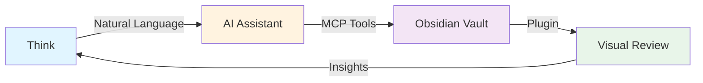
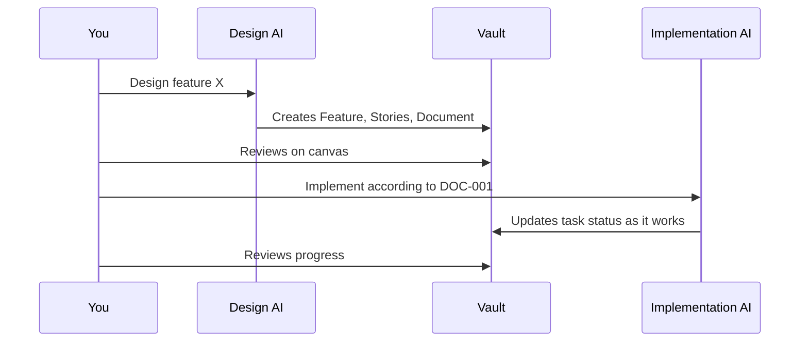

# AI Workflows

Learn how to effectively use AI assistants to manage your projects.

---

## The AI-First Approach



With this system, you think and communicate in natural language, and the AI handles the structured data management.

---

## Common Workflows

### 1. Project Initialization

**Goal:** Start a new project from scratch

```
I'm starting a new project to build [description]. Help me structure it into milestones and stories.

Requirements:
- [requirement 1]
- [requirement 2]
- Target: [timeline]
```

**AI will:**
1. Ask clarifying questions
2. Suggest milestone breakdown
3. Propose initial stories
4. Create the structure

**You then:**
1. Review on canvas
2. Refine with AI
3. Add details

---

### 2. Daily Standup

**Goal:** Quick status update and planning

```
What did I work on yesterday? (check completed tasks)
What's in progress? (check InProgress items)
What should I work on today? (check priorities and blockers)
```

---

### 3. Sprint Planning

**Goal:** Plan next iteration

```
Show me all NotStarted stories in M-001
Which stories are highest priority?
What are the dependencies for S-005?
Create tasks for S-005 based on the description
```

---

### 4. Dependency Analysis

**Goal:** Understand what's blocking progress

```
What's blocking M-001 from completion?
Show me the dependency chain for S-003
Are there any circular dependencies?
What can I work on that has no blockers?
```

---

### 5. Progress Reporting

**Goal:** Generate status reports

```
What's the completion percentage of M-001?
List all completed stories this week
Show me stories assigned to [person]
What's at risk of missing the deadline?
```

---

### 6. Bulk Operations

**Goal:** Make many changes at once

```
Move all NotStarted stories from M-001 to M-002
Change workstream from "eng" to "engineering" for all tasks
Archive all Completed milestones
Update all High priority items to Critical
```

!!! tip "Dry Run First"
    Always ask AI to show what will change before executing bulk operations

---

## Advanced Patterns

### Spec-Driven Development



**Workflow:**
1. Use AI to design and create spec (DOC-xxx)
2. Review spec visually
3. Use different AI to implement based on spec
4. Track progress on canvas

---

### Decision Documentation

```
Create a decision about [topic]:
- Context: [background]
- Options considered: [A, B, C]
- Decision: [chosen option]
- Rationale: [why]
- Affects: [S-001, M-002]
```

**Benefits:**
- Historical record of "why"
- Links to affected entities
- Searchable decision log

---

### Feature Tracking

```
Create feature "User Notifications":
- Workstream: engineering
- Priority: High
- Implemented by: S-010, S-011, S-012

Show me completion status of F-001
What stories still need to be done for F-001?
```

---

## Best Practices

!!! success "Do"
    - Use natural language - don't worry about exact syntax
    - Ask AI to explain what it will do before confirming
    - Review changes on canvas after bulk operations
    - Use AI for analysis and insights, not just CRUD
    - Document decisions as you make them

!!! failure "Don't"
    - Don't manually edit YAML frontmatter (use AI instead)
    - Don't create complex dependency chains without reviewing
    - Don't skip visual review after major changes
    - Don't forget to sync relationships (AI does this automatically)

---

## Example Conversations

### Planning a Feature

```
You: I need to add user authentication to the app

AI: I can help you plan that. Let me ask a few questions:
    - What authentication methods? (email/password, OAuth, etc.)
    - Do you need password reset functionality?
    - Should this be part of an existing milestone or new one?

You: Email/password and Google OAuth. Yes to password reset. 
     Add to M-001 (MVP Launch)

AI: Great! I'll create:
    - F-001: User Authentication System
    - S-010: Email/Password Authentication (implements F-001)
    - S-011: Google OAuth Integration (implements F-001)
    - S-012: Password Reset Flow (implements F-001)
    All under M-001. Should I proceed?

You: Yes, and add a decision document about why we chose Google over Facebook

AI: ✓ Created F-001, S-010, S-011, S-012
    ✓ Created DEC-005: Choose Google OAuth over Facebook OAuth
    All entities linked appropriately.
```

---

## Tips for Effective AI Collaboration

### Be Specific

❌ "Create some tasks"  
✅ "Create 3 tasks for S-001 covering setup, implementation, and testing"

### Provide Context

❌ "What's the status?"  
✅ "What's the status of M-001 and what's blocking completion?"

### Use Iterations

1. Start broad: "Help me plan a blog feature"
2. Refine: "Add SEO optimization to that"
3. Detail: "Break down the SEO story into specific tasks"

### Leverage AI's Strengths

- **Analysis:** "What's the critical path?"
- **Suggestions:** "What am I missing for this feature?"
- **Validation:** "Are there any circular dependencies?"
- **Reporting:** "Summarize progress this week"

---

## Next Steps

- [Visual Canvas Guide](visual-canvas.md) - Learn to use the Obsidian plugin
- [Entity Management](entity-management.md) - Deep dive into entities
- [Common Workflows](../examples/workflows.md) - More workflow examples

