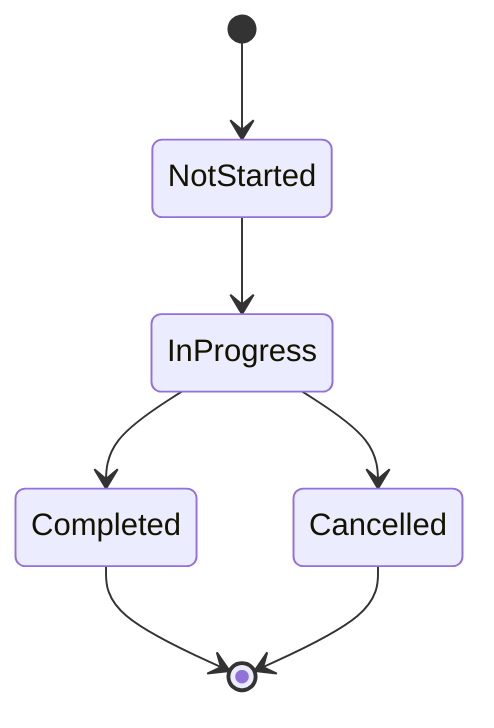

# Entity Management

Complete guide to managing entities in your project.

See [Entity Schemas](../reference/entity-schemas.md) for detailed schema reference.

## Entity Lifecycle

## Creating Entities

Use AI to create entities via natural language. See [AI Workflows](ai-workflows.md).

## Updating Entities

Update status, assignees, and other fields via AI commands.

## Archiving

Completed or cancelled entities can be archived to keep vault clean.

---

See [User Guide Overview](overview.md) for complete documentation.
