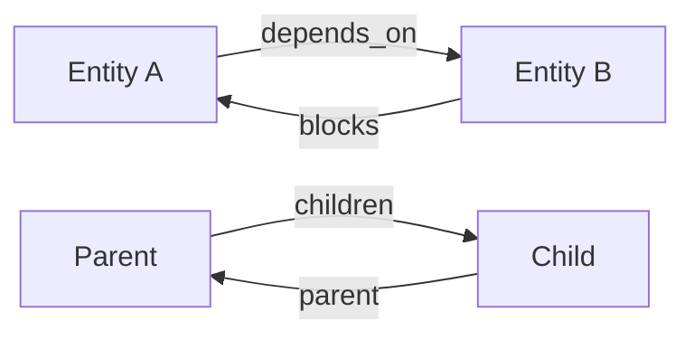

# Relationships

Understanding and managing entity relationships.

## Relationship Types

## Hierarchy

- Milestones contain Stories
- Stories contain Tasks
- Automatic bidirectional sync

## Dependencies

- Any entity can depend on another
- Circular dependency detection
- Automatic `blocks` relationship

## Best Practices

- Keep dependency chains simple
- Use AI to analyze dependencies
- Review visually on canvas

---

See [User Guide Overview](overview.md) for complete documentation.
