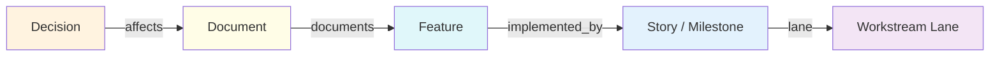

# Relationships

> **The seven relationship types, how they position entities on the canvas, and how to keep your graph healthy**

Relationships are stored as YAML frontmatter fields on entities. Every relationship is **bidirectional and auto-synced**: when you set the forward field on one entity, the system writes the matching reverse field on the target. You never maintain both sides by hand.

All relationship definitions live in your vault's [`schema.json`](schema-and-customization.md) — the table below describes the built-in default schema.

---

## The Seven Relationship Types

| Relationship | Forward field | Reverse field | Connects | Positioning role |
|--------------|---------------|---------------|----------|------------------|
| **Hierarchy** | `parent` | `children` | task → story, story → milestone | Containment |
| **Dependency** | `depends_on` | `blocks` | milestone → milestone, story → story, task → task (same type only) | Sequencing |
| **Implementation** | `implements` | `implemented_by` | milestone/story → feature | Containment |
| **Documentation** | `documents` | `documented_by` | document → feature | Containment |
| **Decision Impact** | `affects` | `decided_by` | decision → document | Containment |
| **Supersession** | `supersedes` | `superseded_by` | decision → decision | Sequencing |
| **Versioning** | `previous_version` | `next_version` | document → document | Sequencing |

!!! note "`decided_by` appears twice"
    On a **decision**, `decided_by` is a plain field naming the person who decided. On a **document**, `decided_by` is the auto-written reverse of a decision's `affects`. Same name, different entity types — no collision.

---

## Containment vs Sequencing

Every relationship plays one of two roles in the [canvas layout](visual-canvas.md):

- **Containment** relationships decide *where an entity lives* — which container it is nested inside.
- **Sequencing** relationships decide *the order of siblings* within a container or lane. `depends_on` places an entity *after* what it depends on; `supersedes` places the newer decision *before* the one it replaces; `previous_version` orders document versions.

### The containment chain

Containment relationships link up into a chain that anchors everything to a workstream lane:


```mermaid
graph LR
    DEC[Decision] -->|affects| DOC[Document]
    DOC -->|documents| F[Feature]
    F -->|implemented_by| S[Story / Milestone]
    S -->|lane| WS[Workstream Lane]

    style DEC fill:#fff3e0
    style DOC fill:#fffde7
    style F fill:#e0f7fa
    style S fill:#e3f2fd
    style WS fill:#f3e5f5
```

- A **feature** enters the canvas **only** via `implements` from a story or milestone — a feature nobody implements has no anchor.
- A **document** anchors to the feature it `documents`.
- A **decision** anchors to the document it `affects`.
- Stories and tasks nest under their `parent`; milestones sit in their workstream lane.

If any link in the chain is missing, everything downstream of the break loses its anchor and lands in the orphan area.

### First target is the anchor

Containment resolves to a **single** container. When a relationship field lists multiple targets, the **first** listed target is the positioning anchor; the rest are drawn as edges only.

```yaml
# DOC-007 will be positioned under F-001; F-002 gets an edge only
documents: [F-001, F-002]
```

!!! tip "Order your lists deliberately"
    Put the *primary* target first in `documents`, `affects`, and `implemented_by` lists. Reordering the list moves the entity on the canvas.

---

## Hierarchy

The 3-tier execution structure:

- Milestones contain Stories (`story.parent = M-xxx`)
- Stories contain Tasks (`task.parent = S-xxx`)
- Setting `parent` auto-populates the parent's `children`

## Dependencies

- Same-type only: milestones depend on milestones, stories on stories, tasks on tasks
- Setting `depends_on` auto-populates `blocks` on the target
- **Cycle detection** rejects circular dependencies
- **Transitive reduction** removes redundant edges (if C→B and B→A, a direct C→A is dropped)
- On the canvas, dependents are sequenced *after* their dependencies

---

## Fan-Out Guidelines (Validation Advisories)

`validate_project` reports soft **advisories** alongside hard violations. Advisories are best-practice guidance — they **never block writes**:

| Advisory | Guideline | Why |
|----------|-----------|-----|
| `DOCUMENT_FANOUT` | A document should document **≤ 2** features | A document anchors to its *first* feature; wide fan-out strands it between distant clusters |
| `DECISION_FANOUT` | A decision should affect **≤ 2** documents | Decisions position next to their first affected document; long lists scatter meaning |
| `FEATURE_IMPLEMENTER_FANOUT` | A feature should have **≤ 3** implementers | Only the first implementer positions the feature; the rest are edge-only |

Each advisory comes with a concrete reorganization suggestion — e.g. split a wide document into per-feature documents linked via `previous_version`, narrow a decision's `affects` to the documents that materially change, or designate one umbrella story as a feature's primary implementer. Reconcile advisories gradually; don't treat them as errors. See [Schema & Customization](schema-and-customization.md) for how these rules derive from the schema.

---

## Best Practices

- **Give every feature an implementer** — unimplemented features have no canvas anchor
- **Put the primary target first** in multi-target relationship lists
- **Keep dependency chains simple** — let transitive reduction do its job
- **Use AI to analyze** — "What's blocking S-006?", "Find circular dependencies"
- **Review visually** on the [canvas](visual-canvas.md), then fix with [`reconcile_relationships`](relationship-reconciliation.md) if sides drift

---

## See Also

- [Schema & Customization](schema-and-customization.md) — define your own relationships and positioning roles
- [Visual Canvas](visual-canvas.md) — how positioning uses these relationships
- [Relationship Reconciliation](relationship-reconciliation.md) — repairing inconsistent bidirectional links
