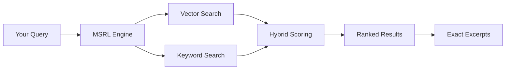

# Semantic Search (MSRL)

**Hybrid vector + keyword search across your entire vault**

---

## Overview

Semantic Search (MSRL - Markdown Structured Retrieval Library) enables AI to search your entire Obsidian vault using **meaning**, not just keywords. It combines:

- **75% Vector Similarity** - Understands semantic meaning
- **25% BM25 Keyword Matching** - Finds exact terms

This is a **killer feature** for solo developers who need AI to understand their entire project context, not just structured entities.

---

## How It Works



### Key Features

1. **Hierarchical Indexing** - Respects Markdown heading structure
2. **Exact Provenance** - Returns file path, heading, and character position
3. **Incremental Updates** - Only re-indexes changed files (~750ms)
4. **Auto-Reindexing** - Watches for file changes automatically
5. **Immutable Snapshots** - Atomic updates with rollback capability

---

## Use Cases

### 1. Finding Implementation Details

```
Human: "How does authentication work in our system?"
AI: Uses search_docs → finds relevant sections across specs, decisions, and code
AI: "I found 8 relevant sections. The main authentication flow is..."
```

### 2. Discovering Related Decisions

```
Human: "What decisions did we make about database choice?"
AI: Uses search_docs with filter → finds all DEC-* files mentioning databases
AI: "Found 3 decisions: DEC-001 (PostgreSQL), DEC-015 (Redis), DEC-023 (Backup strategy)"
```

### 3. Researching Past Work

```
Human: "Find all mentions of error handling in the vault"
AI: Uses search_docs → searches across all markdown files
AI: "Found 12 relevant sections across stories, tasks, and documentation"
```

---

## MCP Tools

### `search_docs`

Semantic search across all documents in the vault.

**Parameters:**

| Parameter | Type | Required | Description |
|-----------|------|----------|-------------|
| `query` | string | ✅ | Search query text |
| `top_k` | integer | ❌ | Number of results (default: 8, max: 50) |
| `max_excerpt_chars` | integer | ❌ | Max excerpt length (default: 4000, max: 20000) |
| `filters.doc_uri_prefix` | string | ❌ | Filter to documents starting with path (e.g., "stories/") |
| `filters.doc_uris` | array | ❌ | Filter to specific document URIs |
| `filters.heading_path_contains` | string | ❌ | Filter to sections containing heading text |
| `include_scores` | boolean | ❌ | Include detailed scores in results |

**Example:**

```json
{
  "query": "authentication implementation",
  "top_k": 10,
  "filters": {
    "doc_uri_prefix": "decisions/"
  }
}
```

**Returns:**

```json
{
  "results": [
    {
      "doc_uri": "decisions/DEC-001_PostgreSQL_Database.md",
      "heading_path": "Security > Authentication",
      "excerpt": "We chose JWT tokens for authentication...",
      "start_char": 1234,
      "end_char": 1456,
      "vector_score": 0.85,
      "bm25_score": 0.72,
      "hybrid_score": 0.81
    }
  ],
  "count": 1,
  "took_ms": 45
}
```

---

### `msrl_status`

Check the status of the semantic search index.

**Parameters:** None

**Returns:**

```json
{
  "state": "ready",
  "snapshot_id": "snapshot_20260124_143022",
  "stats": {
    "doc_count": 156,
    "node_count": 892,
    "leaf_count": 2341,
    "shard_count": 3
  },
  "watcher": {
    "active": true,
    "last_event": "2026-01-24T14:30:22Z"
  }
}
```

---

## Integration with `search_entities`

The `search_entities` tool supports semantic search mode:

```json
{
  "query": "authentication",
  "semantic": true,
  "filters": {
    "type": ["story", "task"]
  }
}
```

This combines:
- MSRL semantic search across entity files
- Entity-specific filtering (type, status, workstream)
- Structured entity results

---

## Setup

### 1. Model Download

On first run, MSRL downloads the **bge-m3** embedding model (~615MB) from HuggingFace:

```bash
# Pre-download models (optional)
npx obsidian-accomplishments-mcp download-models

# Or set custom model path
export MSRL_MODEL_PATH=/path/to/models/bge-m3/model.onnx
```

### 2. Initial Indexing

The first index build takes ~30-60 seconds for a typical vault (100-200 files):

```
[MSRL] Building initial index...
[MSRL] Indexed 156 documents, 2341 chunks
[MSRL] Index ready in 42.3s
```

### 3. Incremental Updates

After initial indexing, updates are fast (~750ms per file):

```
[MSRL] File changed: stories/S-015_Authentication.md
[MSRL] Re-indexed in 0.8s
```

---

## Best Practices

### ✅ DO

- **Use for discovery** - "Find all mentions of X"
- **Use for context** - "What did we decide about Y?"
- **Use with filters** - Narrow down to specific folders
- **Use semantic mode** - When meaning matters more than exact keywords

### ❌ DON'T

- **Don't use for listing** - Use `list_files` instead
- **Don't use for specific entities** - Use `get_entity` instead
- **Don't use for structured queries** - Use `search_entities` without `semantic=true`

---

## Performance

| Operation | Time | Notes |
|-----------|------|-------|
| Initial index (200 files) | ~45s | One-time cost |
| Single file update | ~750ms | Incremental |
| Search query | ~50-200ms | Depends on vault size |
| Model load | ~2s | On server start |

---

## Troubleshooting

### Index Not Ready

```
Error: MSRL index not ready (state: building)
```

**Solution:** Wait for initial indexing to complete. Check status with `msrl_status`.

### Model Download Failed

```
Error: Failed to download bge-m3 model
```

**Solution:** Check internet connection or manually download model:

```bash
npx obsidian-accomplishments-mcp download-models
```

### Slow Search

```
Search took 5000ms (expected <200ms)
```

**Solution:** 
- Reduce `top_k` parameter
- Use `doc_uri_prefix` filter to narrow search
- Check vault size (>1000 files may need optimization)

---

## Next Steps

- [AI Workflows](ai-workflows.md) - Learn how to use semantic search in AI conversations
- [MCP Tools Reference](../reference/mcp-tools.md) - Complete tool documentation
- [Best Practices](best-practices.md) - Tips for effective search queries

