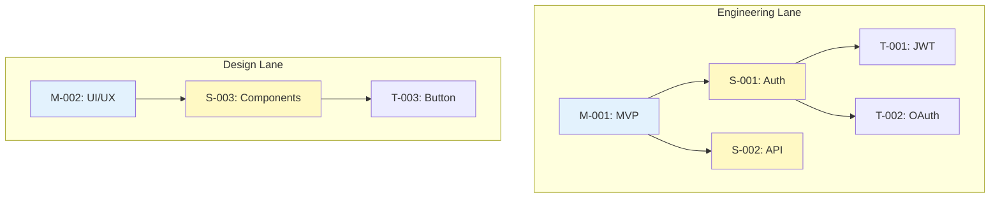

# Visual Canvas Guide

Learn how to use the Obsidian Canvas Project Manager plugin for visual project management.

---

## Canvas Layout

The plugin organizes entities on a canvas using a hierarchical, workstream-based layout.

---

## Plugin Commands

### Populate from Vault
Reads all entities from vault and adds them to canvas.

**Usage:** `Ctrl/Cmd+P` → "Project Canvas: Populate from vault"

### Reposition Nodes
Automatically arranges nodes in hierarchical layout.

**Usage:** `Ctrl/Cmd+P` → "Project Canvas: Reposition nodes"

### Refresh Canvas
Reloads entities and updates display.

**Usage:** `Ctrl/Cmd+P` → "Project Canvas: Refresh"

---

## Visual Features

- **Color Coding** - Different colors for entity types
- **Status Indicators** - Visual status badges
- **Relationship Lines** - Arrows show dependencies
- **Workstream Lanes** - Horizontal lanes by workstream
- **Hierarchical Layout** - Parent-child positioning

---

## Best Practices

!!! tip "Regular Refresh"
    Refresh canvas after making changes via AI

!!! tip "Use Reposition"
    Run reposition after adding many entities

!!! tip "Manual Adjustments"
    Feel free to manually adjust node positions

---

See [User Guide Overview](overview.md) for complete documentation.
