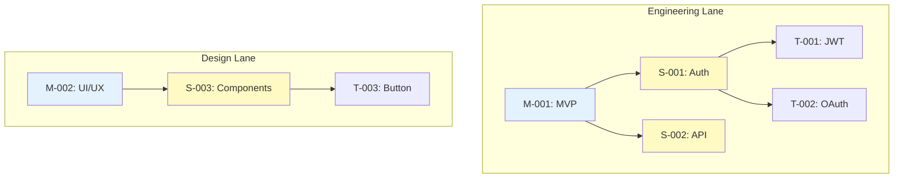

# Visual Canvas Guide

Learn how to use the Obsidian Canvas Project Manager plugin for visual project management.

---

## Canvas Layout

The plugin organizes entities on a canvas using a hierarchical, workstream-based layout.


```mermaid
graph TD
    subgraph "Engineering Lane"
        M1[M-001: MVP]
        S1[S-001: Auth]
        S2[S-002: API]
        T1[T-001: JWT]
        T2[T-002: OAuth]
    end
    
    subgraph "Design Lane"
        M2[M-002: UI/UX]
        S3[S-003: Components]
        T3[T-003: Button]
    end
    
    M1 --> S1
    M1 --> S2
    S1 --> T1
    S1 --> T2
    M2 --> S3
    S3 --> T3
    
    style M1 fill:#e3f2fd
    style M2 fill:#e3f2fd
    style S1 fill:#fff9c4
    style S2 fill:#fff9c4
    style S3 fill:#fff9c4
```

---

## How Positioning Works

The layout engine positions every entity by walking its **containment chain** down to a workstream lane. Which relationships count as containment (nesting) vs sequencing (ordering) is defined per-relationship in your vault's [`schema.json`](schema-and-customization.md) — the description below reflects the default schema.

### Lanes

Each workstream gets a horizontal lane. Milestones sit in their lane; everything else is placed relative to a container that eventually resolves to a lane.

### Containment nesting

Containment relationships nest entities inside one another:

```
Workstream lane
└── Milestone / Story                (hierarchy: parent)
    └── Feature                      (implements — the ONLY way features enter the canvas)
        └── Document                 (documents)
            └── Decision             (affects)
```

- A **feature** is positioned only when a story or milestone `implements` it — features nobody implements have no anchor.
- A **document** anchors to the feature it `documents`; a **decision** anchors to the document it `affects`.
- When a relationship lists **multiple targets, the first one is the anchor** — the rest are drawn as edges only. Order your lists deliberately.
- Multi-target ("deferred") documents and decisions are resolved by an iterative fixpoint pass: once their first-listed container is placed, they are placed beside it — even at the end of deep chains like decision → document → feature → story.

### Sequencing

Sequencing relationships order siblings within a container or lane: `depends_on` places an entity **after** its dependencies, `supersedes` places the newer decision **before** the superseded one, and `previous_version` orders document versions.

### The orphan grid

Entities with **no resolvable anchor** — no parent, no containment relationship, nothing inferring a container — are collected into an orphan grid at the edge of the canvas. If something you expected inside a lane shows up there, a link in its containment chain is missing (most often a feature without an implementer). The orphan grid is only for genuinely unanchored entities; multi-target documents/decisions no longer land there.

!!! tip "Keep entities anchored"
    Give every feature an implementer, and keep the *primary* target first in `documents`, `affects`, and `implemented_by` lists.

---

## Plugin Commands

### Populate from Vault
Reads all entities from vault and adds them to canvas.

**Usage:** `Ctrl/Cmd+P` → "Project Canvas: Populate from vault"

### Reposition Nodes
Runs the positioning engine described above and arranges all nodes.

**Usage:** `Ctrl/Cmd+P` → "Project canvas: reposition nodes (v4 algorithm)"

### Refresh Canvas
Reloads entities and updates display.

**Usage:** `Ctrl/Cmd+P` → "Project Canvas: Refresh"

---

## Visual Features

- **Color Coding** - Different colors for entity types
- **Status Indicators** - Visual status badges
- **Relationship Lines** - Arrows show dependencies
- **Workstream Lanes** - Horizontal lanes by workstream
- **Hierarchical Layout** - Parent-child positioning

---

## Best Practices

!!! tip "Regular Refresh"
    Refresh canvas after making changes via AI

!!! tip "Use Reposition"
    Run reposition after adding many entities

!!! tip "Manual Adjustments"
    Feel free to manually adjust node positions

---

## See Also

- [Relationships](relationships.md) — the containment chain and fan-out guidelines in detail
- [Schema & Customization](schema-and-customization.md) — change positioning roles per relationship
- [User Guide Overview](overview.md) — complete documentation
